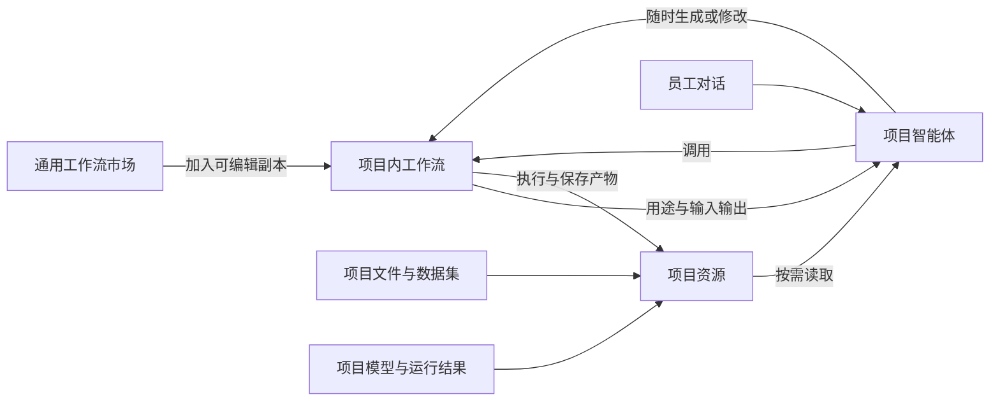

# 机器学习流程与通用工作流市场调研

调研日期：2026-09-21。面向 Lilies 公司内部试用，优先覆盖 CSV/Excel 表格及工业过程时序。

本次采用官方文档调研与当前仓库只读核对；没有安装其他平台、执行训练基准、调用付费模型或开发市场功能。文中外部产品能力有就近来源；“建议”是针对 Lilies 的设计判断。stable/latest 文档会变化，文档能力不代表本机已安装版本拥有同样能力。

## 1. 主要结论

1. **方法论允许迭代，计算流程应可复用。** 业务理解、探索、建模和评估常常往返；其中已经确定的清洗、特征计算和预测应能独立调用。
2. **市场应该提供有明确用途、表单和结果的流程。** 员工选择“预测产品质量”，再按需展开特征与模型参数。算法作为内部可替换方法。
3. **完整任务流程和阶段流程并存。** 一次完成建模，也允许只分析资料、只制备样本、只对新数据预测。
4. **数据集和中间结果要能被看到、选择和复用。** 用户需要知道关联后剩了多少样本、特征怎么来的、哪批数据误差大。
5. **Lilies 已有相当部分训练基础。** 下一步优先改善从文件到训练的输入接口、阶段结果展示与模板安装。现有模型调用、计算环境和画布可继续使用。
6. **先建立内部模板目录。** 用公司常见任务验证可复用性，再决定外部市场、第三方分发与更多模型框架的范围。

## 2. 方法论与可执行工作流如何对应

CRISP-DM 把项目组织为业务理解、数据理解、数据准备、建模、评估和部署。官方说明明确指出阶段顺序并不严格，项目会按需要往返。适合借用它检查是否遗漏问题，不应把六个阶段变成生成工作流前必须通过的审批步骤。[IBM CRISP-DM](https://www.ibm.com/docs/en/spss-modeler/18.6.0?topic=dm-crisp-help-overview)

建议将员工的工作分为两种可相互转换的活动：

- **探索与决策：** 理解目标、判断样本含义、提出特征假设、解释失败、决定是否扩大搜索。由员工和智能体协作，可跳转、补充和停止。
- **可重复计算：** 读取、关联、转换、分割、训练、评估、预测。保存为可编辑工作流，接收明确输入，输出数据或模型结果。

工作流可以在探索前、过程中或结束后创建。生成与保存只需要合法结构和项目允许的能力，资源可以后续绑定。这里是产品设计建议，沿用 [Lilies 产品定义](PRODUCT_NORTH_STAR.md)。

### 2.1 先确定样本、目标与使用方式

| 场景 | 一个样本 | 目标与预测时点 | 主要方法差异 |
|---|---|---|---|
| 表格数值预测 | 一个产品或一次工况 | 用当时已知字段预测强度、能耗等数值 | 表格预处理、回归、业务误差分析 |
| 表格分类 | 一个产品或一次事件 | 判断合格、缺陷类型、故障类别 | 类别比例、阈值、漏检与误报成本 |
| 批次过程质量预测 | 一个批次在指定时点的历史测量 | 用截至该时点的过程曲线预测最终质量 | 标签关联、历史窗口、时序特征、批次划分 |
| 未来序列预测 | 某设备在某预测起点的历史 | 预测未来若干步数值 | 预测步长、滚动回测、未来可知协变量 |
| 异常检测 | 单行、窗口或批次 | 找异常或偏离正常状态的记录 | 正常参考集、异常评分、阈值与后续人工/标签核验 |
| 群体探索 | 产品、设备或批次 | 发现相似群体 | 聚类、降维、可视化；不默认具有预测标签 |

这是模板分类建议，不能从文件扩展名直接推断。过程曲线预测最终质量与预测未来序列应分别提供模板；“支持时序特征”也不等于已经实现通用序列预测。

### 2.2 各阶段方法、输入和结果

| 阶段工作流 | 输入与方法 | 需要暴露的选择 | 可复用产物 |
|---|---|---|---|
| 数据体检 | 字段类型、缺失、重复、分布、标签比例、分组差异、采样间隔 | 工作表、标识、时间、目标及分组字段 | 数据概况、图表、问题样本；保留原文件 |
| 清洗与关联 | 类型/单位转换、去重、关联、重采样、缺失和异常处理 | 主键、关联基数、时间容差、处理规则 | 新数据版本、保留/排除原因、关联前后行数 |
| 样本制备 | 产品/批次聚合、滑动窗口、标签连接、预测时点和可用时间过滤 | 样本单位、窗口、步长、预测范围 | 样本表、标签及来源对应关系 |
| 数据划分 | 随机/分层、分组、时间、时间间隔与重叠处理 | 实际要泛化到什么新数据 | 固定的开发集/测试集与验证折索引 |
| 特征制作 | 领域公式、编码、变换、窗口统计、滞后、趋势、频域、筛选 | 特征来源、计算定义、窗口与排除字段 | 特征表、特征定义；需要拟合的转换保留为训练方法 |
| 基线与训练 | 常数/多数类基线、线性、树、梯度提升；按条件选择更复杂模型 | 目标指标、候选模型、搜索范围、时间和试验上限 | 模型对照、逐折结果、参数与训练产物 |
| 误差诊断 | 回归残差、分类混淆与阈值、分设备/批次误差、特征贡献 | 业务容差、重点人群/工况、诊断维度 | 错误样本、分组指标和图表 |
| 模型登记与预测 | 固定模型、预处理、字段语义与运行环境，处理新数据 | 模型版本、输入映射 | 模型资源、预测文件和运行记录 |
| 后续复评 | 输入分布变化、有标签后的效果比较、必要时重训 | 比较区间、参考版本、业务指标 | 新评价或新模型版本 |

上述是方法目录，不要求每次执行全部阶段。聚合或去重会改变样本，不能把删去难样本后得到的指标直接和旧结果比较。

### 2.3 影响统计正确性的几个边界

**训练集上学习转换。** 填补值、缩放、PCA、特征筛选等需要拟合的操作放入训练 Pipeline；交叉验证时在各训练折内重新拟合，验证集只应用转换。最终预测使用训练时保存的转换。特征表可以提前存在，但不能把从全部样本学习的参数当成合法的折内转换。[scikit-learn 常见问题](https://scikit-learn.org/stable/common_pitfalls.html)

**验证模拟实际使用。** 独立样本可随机/分层；重复设备或批次要根据泛化目标考虑组隔离；预测未来采用时间验证。新设备上的泛化和同一设备未来表现是两个不同问题。分组与时间条件可能要联合处理，一个下拉选项不应宣称覆盖全部情况。[scikit-learn 交叉验证](https://scikit-learn.org/stable/modules/cross_validation.html)

**区分测量时间和真正可用时间。** 例如某检测结果在 10:00 采样、12:00 才出结果，11:00 的预测不能使用它。Feast 文档区分事件时间关联与已创建/可用时间过滤；Featuretools 用 cutoff time 限制特征计算可使用的记录。Lilies 应保留这些语义，首版不必因此引入完整 Feature Store。[Feast 时间点关联](https://docs.feast.dev/getting-started/concepts/point-in-time-joins)、[Featuretools 时间处理](https://docs.featuretools.com/en/stable/getting_started/handling_time.html)

**窗口制备与特征提取分开。** tsfresh 的 rolling 先把序列切成可用于建模的窗口，再提取特征。窗口、目标对齐和重叠处理应由样本制备说明，不能隐藏在“自动提取特征”里。[tsfresh 滚动窗口](https://tsfresh.readthedocs.io/en/latest/text/forecasting.html)

**不平衡处理限定在训练部分。** 重采样不能先作用于全部数据再分割；评价分布应反映需要评估的实际情况。补充 Precision/Recall、PR 曲线或业务阈值时，要用验证数据选择参数，保留测试数据用于最终效果估计。[imbalanced-learn 常见问题](https://imbalanced-learn.org/stable/common_pitfalls.html)、[scikit-learn 评价指标](https://scikit-learn.org/stable/modules/model_evaluation.html)

这些规则应由相应计算步骤正确实现，并解释具体输入错误。它们不构成工作流生成的过程门槛。

### 2.4 自动特征与 AutoML 的作用范围

| 方法/工具 | 已公开能力 | 对 Lilies 的建议 |
|---|---|---|
| tsfresh | 按序列/窗口计算特征，可用于分类、回归相关任务与特征式预测 | 继续用于过程数据，先提供小特征集；更大特征集按需开启。见上方官方来源。 |
| Featuretools | 基于时间索引、截止时点计算特征 | 多表历史聚合需求明确后再评估接入；先做好主键、关系和可用时间。见上方官方来源。 |
| Optuna | 多种参数采样器及利用中间结果的剪枝机制 | 用于明确搜索空间；只有训练器能提供有效中间评价时才讨论剪枝收益。[官方算法说明](https://optuna.readthedocs.io/en/stable/tutorial/10_key_features/003_efficient_optimization_algorithms.html) |
| AutoGluon Tabular | 时间限制、质量/部署预设、模型排除及组合配置 | 作为训练策略选项，与其他候选使用同一外层评价条件；不承诺必然优于单模型。[官方深入教程](https://auto.gluon.ai/stable/tutorials/tabular/tabular-indepth.html) |

AutoML 能帮助搜索模型，样本定义、标签可用性和业务目标仍需正确表达。对首批员工，建议默认提供有限预算的基线对照，再允许追加实验。

## 3. 工作流产品与框架比较

本表比较的是产品结构与接口设计，没有性能排名。“适合借鉴”列是研究判断，不是已决定引入的依赖。

| 对象 | 官方设计事实 | Lilies 值得借鉴的部分 | 近期取舍建议 |
|---|---|---|---|
| KNIME | Component 可封装子流程，具有配置对话框、组合视图，并通过 Hub 共享；Metanode 主要用于组织图。[组件指南](https://docs.knime.com/ap/latest/analytics_platform_components_guide/) | 一个阶段既是可调用流程，又有面向员工的表单和结果页 | 优先借鉴组件体验；先实现少量真正有用的阶段 |
| Dataiku DSS | Dataset 与 Recipe 共同组成 Flow；Recipe 可视化配置或使用代码，表达数据输入输出。[DSS 概念](https://doc.dataiku.com/dss/latest/concepts/index.html) | 数据与操作同时可见，关联、清洗后的结果可检查 | 画布节点结果应能预览数据，无需立即复制其全部数据平台 |
| Kedro | Pipeline 用输入、输出、参数和 namespace 支持模块复用。[模块化流程](https://docs.kedro.org/en/stable/build/modular_pipelines/) | 流程内使用逻辑名称，加入项目时绑定具体资源 | 可借用输入输出映射思想，保留 Lilies 的工作流定义 |
| DVC | 可依据依赖、参数与输出状态选择需要重跑的阶段，复用未变化结果。[运行流程](https://doc.dvc.org/user-guide/pipelines/running-pipelines) | 修改评估或模型时，复用有效的数据准备和特征结果 | 扩展现有特征缓存前先找实际重复计算点 |
| Metaflow | Python 步骤表达流程，支持分支与 foreach，数据产物沿步骤传递并在汇合处处理。[创建流程](https://docs.metaflow.org/metaflow/basics) | 训练多个候选时直接管理步骤产物，保持失败位置可见 | 借用概念，不新增第二套执行底座 |
| Kubeflow Pipelines | 用容器组件表达参数和数据产物，运行转换为 Kubernetes 任务；支持执行缓存。[Pipeline 概念](https://www.kubeflow.org/docs/components/pipelines/concepts/pipeline/)、[缓存](https://www.kubeflow.org/docs/components/pipelines/user-guides/core-functions/caching/) | 数据集、模型、指标是明确的步骤产物 | 本地 CPU/Docker 主线暂不引入 Kubernetes；分布式资源需求出现后再评估 |
| MLflow | 模型登记区分版本与可变别名，别名可重新指向版本。[模型注册表](https://mlflow.org/docs/latest/ml/model-registry/) | 逻辑模型名称方便调用，运行固定实际版本 | Lilies 已有 model_ref，优先完善其展示和使用 |

研究建议的组合是：**KNIME 的可配置组件体验、Dataiku 的数据可见性、Kedro 的流程复用，以及 DVC 的局部重算思想**。这些都可以作为现有 Lilies 的设计参考，无需先把这些系统全部部署起来。

## 4. 建议的市场条目形态

### 4.1 两层目录

完整任务层面向员工：数据健康检查、表格数值预测、表格分类、过程曲线质量预测、新数据批量预测。

阶段层面向组合与修改：清洗关联、样本制备、特征制作、基线对比、搜索训练、误差诊断、模型登记与预测。智能体可以调用整套流程，也能只调用其中一个阶段。

算法放在流程配置中。例如“表格数值预测”可选线性模型、随机森林等；确有独立输入输出需求的方法再单独做条目。

### 4.2 条目应携带的内容

| 内容 | 员工或智能体为什么需要 |
|---|---|
| 名称、用途、适用数据、限制 | 判断是否适合当前任务 |
| 工作流定义与版本 | 加入项目后可编辑、可继续使用原版本 |
| 输入输出及默认表单 | 直接选择文件、目标列和方法；智能体读同一套定义 |
| 依赖的子工作流与业务代码 | 导入后内部调用和特征转换可用 |
| 运行环境、模型用途与资源占位 | 可以先保存，在运行前明确配置必要资源 |
| 小型公开/合成示例及输出说明 | 员工可以了解使用方式，模板作者可以验证变更 |
| 简短使用说明 | 说明怎么调用、如何换输入、结果存在哪里 |

模板分发流程定义与必要代码，具体项目的文件、模型版本与凭据仍由项目管理。首版建议安装为独立副本并记录模板版本；模板升级由用户选择，保留项目内人工修改。依赖子流程安装时要重映射内部标识，不能把来源项目的 workflow_id 当成通用标识。

这比当前单图 JSON 导入多了表单、依赖和用途说明；不要求用户先完成训练或通过业务测试才能创建模板草稿。

### 4.3 与项目空间、智能体的关系

对话入口负责意图和参数映射，数值计算由平台执行。默认机器学习模板可以完全使用代码和训练积木；是否添加 LLM 分析节点由模板用途和项目权限决定。完整外部智能体积木继续按项目能力开关控制。

## 5. 推荐的两套首批完整流程

以下是待讨论的模板草案，还未开发。

### 5.1 工业表格分类/回归

员工输入：项目文件、工作表、目标列、样本/分组字段、分类或回归、划分方式、主要指标、计算预算。

流程：读取并分析 → 应用明确的清洗/关联规则 → 登记样本与划分 → 在训练折内拟合预处理 → 基线和候选训练 → 展示对照及误差 → 保存模型版本与报告。

员工结果：样本数量及排除原因、基线对照、主要误差、可选模型、可下载报告。随后可以单独运行“新数据预测”，不需要重新训练。

### 5.2 工业过程时序质量预测

员工输入：测量表、标签/预测时点表、产品或批次标识、测量时间、可用时间、预测时点、窗口、目标和预算。

流程：时间与标识体检 → 按预测时点制备样本 → 查看每个样本的历史测量覆盖 → 窗口统计或时序特征 → 分组/时间验证 → 训练与误差诊断 → 登记可复用模型。

需要特别展示：标签匹配率、空窗口、采样间隔、跨批次分布、时间隔离条件。频域特征的解释要核对采样条件；不能看到“有时间列”就默认采用频谱或序列模型。

**未来序列预测另做流程。** 它需要预测步长、多步输出、滚动回测和未来协变量配置，本轮源码中的工艺时序特征路径不能被称为这些功能已经完成。

## 6. 当前 Lilies 能力与缺口

本节依据源码结构与已有说明，没有重跑当前运行验收。能力存在与员工端完整流程好用是不同层面的结论。

| 范围 | 当前可核对内容 | 面向通用流程需要补齐 |
|---|---|---|
| 项目环境 | 共享文件/业务流程、对话引用与生成、单图导入。[项目空间](V06_PROJECT_SPACE.md)、[接口](../platform/backend/src/agent_platform/project_space.py) | 可浏览的模板目录、表单与子流程依赖安装；当前空间入口没有这一完整市场能力 |
| 数据登记 | tabular/timeseries 映射，目标、分组、时间与可用时间字段。[数据契约](../platform/backend/src/agent_platform/modeling_models.py) | 从项目原文件直接配置样本制备，通用关联/清洗方法和结果预览 |
| 评价划分 | random/group/time、留出测试、时间间隔及部分重叠处理。[prepare](../platform/backend/src/agent_platform/modeling_worker.py) | 用业务语言解释适用场景；联合组/时间目标及不规则过程数据的专项验证 |
| 特征 | 字段选择、排除、基础/扩展时序特征、窗口、SelectKBest、自定义折内转换；已有特征缓存。[FeaturePlan](../platform/backend/src/agent_platform/modeling_models.py)、[worker](../platform/backend/src/agent_platform/modeling_worker.py) | 面向员工的特征配方、清洗输入和中间表可见性，避免只能编辑代码 |
| 训练 | sklearn、Optuna、CPU AutoGluon 路径，简单基线、固定外层折、候选预算与分组误差。[evaluate](../platform/backend/src/agent_platform/modeling_worker.py) | 无需提前手工取得 study_id/candidate_id 的完整流程输入；预算和模型对照清晰展示 |
| 资源使用 | 独立训练、model_ref 绑定和预测；任务固定模型引用内容。[项目模型资源](../platform/backend/src/agent_platform/project_resources.py) | 默认模板直接产出可选择模型与配套预测入口 |
| 高级任务 | 当前 Evaluation 明确限定 classification/regression；AutoGluon 使用 TabularPredictor | 异常检测、通用多步预测、在线监测不可直接宣称已经产品化 |

### 6.1 最值得先改的接口问题

当前四类建模积木是 `data_analysis`、`feature_extract`、`model_train`、`model_predict`。训练积木的常见路径运行的是已经登记的研究和候选，需要 `study_id/candidate_id`。独立工具具备登记能力，但单纯把四个积木连接起来，不会自然完成“上传文件到得到模型”的所有工作。[积木定义](../platform/backend/src/agent_platform/modeling_models.py)、[run_block](../platform/backend/src/agent_platform/modeling.py)

建议做一条面向员工的高层流程：接收文件、字段映射、特征方法、评价与预算，内部调用现有服务登记数据和研究、提交候选、训练并返回模型。内部标识由执行服务产生并传递；普通员工不必填写。原有积木继续用于精细搭建。

### 6.2 不能忽略的现有行为限制

- 时序特征路径遇到缺失/无穷测量或没有可用窗口会报错；因此需要可选择的前置清洗方法，不能把这个错误一律交给智能体反复猜代码。[features](../platform/backend/src/agent_platform/modeling_worker.py)
- 当前 sklearn 路径的数值中位数填补/标准化及类别众数填补/独热编码是固定实现；提供方法论目录不代表这些方法已全部能通过表单选择。[pipeline](../platform/backend/src/agent_platform/modeling_worker.py)
- AutoGluon 路径显式不接受自定义拟合转换或 select_k；当前使用 CPU、固定预设，禁用 bagging/stacking。不能把 AutoGluon 官方全部能力写成平台当前功能。[候选校验](../platform/backend/src/agent_platform/modeling.py)、[evaluate](../platform/backend/src/agent_platform/modeling_worker.py)
- 普通训练路径和 `record_scope` 保存用例路径含义不同：后者的训练积木只回放已完成候选，允许真实预测。市场中的“重新训练流程”必须走训练执行路径，不能直接把历史用例当作可训练模板。[run_block](../platform/backend/src/agent_platform/modeling.py)
- 特征缓存已经存在，键包含数据文件记录、字段映射、特征方案和镜像；目前无需重新引入一套缓存系统。进一步复用应先验证失效条件与实际重复计算。[feature_cache](../platform/backend/src/agent_platform/modeling.py)

上述是研究发现，本轮未修改这些行为。

## 7. 计算成本、动态性与失败处理

建议默认把探索对话和重复计算分开计量：记录模型调用/用量、计算耗时、候选数量与复用情况。纯计算流程可以不调用 LLM；智能体在理解任务、解释结果或改变方案时调用模型。

模板运行优先复用确认有效的中间产物：改报告不重训，改模型参数不重做未变化的样本制备，新增预测文件使用既有模型。DVC 和 KFP 的阶段复用说明提供了设计参考，但实际节省比例要在 Lilies 同一输入与配置下测量，不能由产品宣传推断。[DVC](https://doc.dvc.org/user-guide/pipelines/running-pipelines)、[KFP 缓存](https://www.kubeflow.org/docs/components/pipelines/user-guides/core-functions/caching/)

缓存条件应包含实际数据版本、变换代码/参数与环境；同名文件不是相同输入。训练折内拟合结果只能在相同训练划分及配置下复用。外部副作用步骤与随机试验不能无条件照搬数据转换的缓存规则。

错误返回具体失败步骤、输入与原因；可局部修正后继续。重新运行使用新配置，继续原运行保留原快照，用户停止不触发自动恢复。生成工作流仍然可以直接保存，不引入固定角色团队、手册阅读检查或逐阶段审批。

## 8. 内部模板目录与验证建议

先把以下条目做成实际可用的流程，不预设同时实现所有方法：

| 优先次序 | 条目 | 主要输出 |
|---|---|---|
| 首批 | 数据健康检查 | 字段/质量/分组概况与问题样本 |
| 首批 | 表格数值预测 | 基线、模型、误差报告 |
| 首批 | 表格分类 | 模型对照、混淆与业务指标 |
| 首批 | 新数据批量预测 | 预测文件、实际模型版本 |
| 第二批 | 多表关联与样本制备 | 样本版本、标签对应、划分 |
| 第二批 | 工业过程特征与质量预测 | 时点特征、批次/时间评价、模型 |
| 第二批 | 已有模型误差诊断 | 重点工况/设备误差和问题样本 |
| 之后按需要 | 通用多步预测、异常检测、效果监测 | 各自独立的任务与评价定义 |

模板验证建议使用公开或获准内部数据，固定文件版本、划分、预算、硬件与代码，分别比较手工配置、智能体直接工具调用、智能体调用模板三种入口。先做不含付费调用的接口与数值验证，再在授权范围内测实际对话。

需要覆盖的案例：

1. 表格分类和回归：换数据后无需改内部对象标识，输出模型与报告。
2. 重复产品/批次：证明划分按配置处理，报告明确泛化目标。
3. 带延迟的时序：在预测时点之后才可用的数据不会进入特征。
4. 不完整输入：缺目标列、错单位、空窗口、未绑定模型分别给出具体错误。
5. 局部修改：改特征重做相关步骤；只预测不重训；同名不同内容不复用错误产物。
6. 项目复用：模板加入另一个项目后引用正确，生成新流程不覆盖原流程，旧结果仍可查。
7. 资源与停止：限制预算、停止长任务，恢复时保留有效进度并明确重做范围。

衡量指标同时包含员工配置步骤、首次成功耗时、错误修复次数、模型调用/用量、训练耗时、峰值内存、缓存复用及业务效果。当前没有上述三种入口的同条件完整基准，因此不报告未经验证的提速或准确率结论。

## 9. 下一轮讨论需要明确的业务信息

- 首批各取一种表格任务与过程任务：原表长什么样，一行/一个批次代表什么，标签从哪里来。
- 预测的使用时点，以及最在意漏检、误报、数值误差还是工况稳定性。
- 员工希望先看到的交付：数据报告、可选模型、新数据预测还是可部署服务。

已有“CSV/Excel 和过程数据都经常使用”的信息足以确定两条主线。以上细节用于决定模板默认值和示例，无需阻止空白工作流创建。
