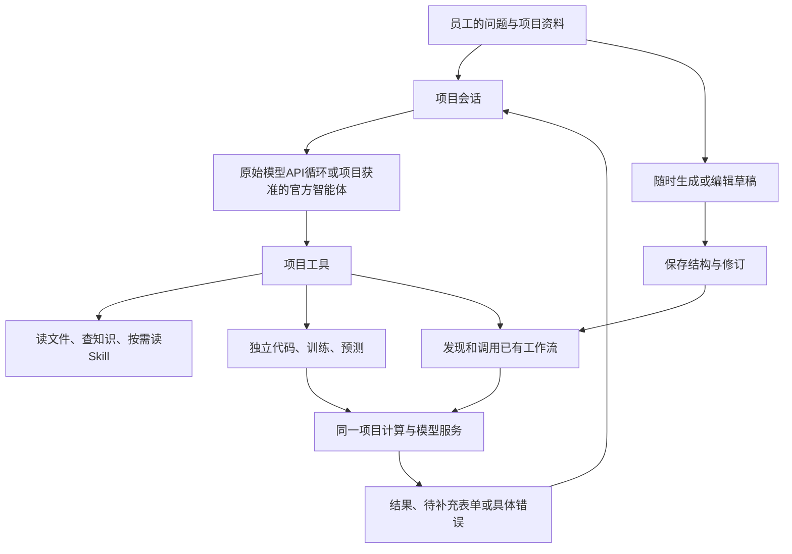

# v0.6 当前执行路径与历史请求复核

2026-09-25。以当前员工项目路径、源码和实际运行核对历史harness问题。本文为开发说明，不是客户执行门槛。

## 当前路径

生成草稿不经过右侧的实际计算。Skill给出可选方法，工作流定义自己的输入、步骤和产物；平台没有统一“先研究、再批准、后训练”顺序。上图的官方智能体与原始API是独立会话来源；业务LLM积木仍使用原始API。

## 逐项结论与依据

| 历史问题 | 当前情况 | 可核对依据 |
|---|---|---|
| 先确认需求或读手册才能开始 | 当前统一项目工具不以确认状态阻止代码、训练和编辑；说明明确允许直接解决问题 | `project_agent_tools.py` 的 `PROJECT_INSTRUCTIONS`、`WorkspaceProjectTools.require_build`；本轮 `test_project_skills_and_tools_without_confirmation` 通过 |
| 模型未就绪就无法保存图 | 生成与运行分离，保存图检查结构、项目能力及并发修订，运行再报告缺项 | `project_workflow_edit.py` 的 `generate_workflow/save_workflow`；本轮未绑定、撤销及冲突用例通过 |
| 修改工作流必须反复调用模型自测 | API生成路径一次响应直接保存，不自动运行测试或业务；测试入口可按需使用 | 同文件生成调用 `tools=[]`；本轮 `test_generation_one_response_no_task_or_approval` 通过 |
| 所有工作必须先搭工作流 | `project_code`、独立训练与预测有直接入口，工作流调用同一能力 | 本轮员工工具读取汇报Skill并直接生成两页PPT/PDF，没有新增工作流任务；训练实测记录见 `V06_REAL_ML.md` |
| 说明、完整图和日志反复进入上下文 | 当前默认提供文件、流程及结果摘要，按需获取正文/节点/完整运行；仍保留少量旧事项字段 | `project_agent_context.py` 的 `conversation_context/draft_summary/task_summary`；Skill列表不返回正文或引用代码，读取接口测试通过 |
| 不同入口的停止与继续混淆 | 会话等待项目计算，停止关联实际任务；人工输入恢复原运行；重新运行使用当前配置 | `local_agents.py`、项目任务与运行快照；此前员工看图复核停止/接续和本轮独立任务停止幂等回归分别记录，不用一次测试概括所有入口 |
| 完整外部智能体被当作原始模型积木 | 项目能力与官方智能体授权单独配置；业务LLM、视觉、Embedding仍使用原始API | `projects.py::blocks_for`、`project_capabilities.py`、`official_agent.py`；验证范围见 `OFFICIAL_AGENT.md` |
| 项目进度与错误看不懂 | 显示实际工作流和待回答任务；默认展示具体错误原因，堆栈可展开 | `b3182d70`；员工旧失败、刷新待回答、手机停止及计数变化已验证 |

旧 `ProjectTools.require_build`、需求提交和受控网页采集仍包含兼容阶段或作业上下文逻辑，不能仅凭搜索到这些名字断言统一项目会话仍走旧限制。当前项目实例使用覆盖后的 `WorkspaceProjectTools`。这些兼容代码未被本轮批量删除；具体入口仍需按实际调用链判断。

没有把“原始模型有智能”当作结果自动正确的保证。保留的检查负责结构、权限、资源、计算版本、停止和预算；业务解释质量需用实际任务检查。并发修订冲突和项目隔离解决真实资源问题，不是额外业务审批。

## 研究与内容交付

- 新增按需「资料研究与方法验证」Skill，组织现有资料阅读、知识检索、材料对照、样本分析、比较与独立计算。已从员工页面查看正文，列表和按需读取/保存/隔离相关7项回归通过。没有新增固定研究阶段、外部搜索账户或模型评分调用。
- PPT能力已完成可运行的小范围交付，见 `PRESENTATION_WORKFLOW.md`；使用已有代码环境，可直接执行，也可作为可编辑工作流。
- 当前 `WebSearch` 实现是Google News RSS新闻索引；旧网页采集需要配置来源和作业上下文。不能将它们描述为完整通用搜索、学术检索或自主联网研究。新Skill只组织已提供能力，不伪造搜索结果。
- 更多训练框架、部署目标和完整自主科研系统在原计划中是扩展方向，未给出具体对象及验收输入。本轮没有凭名称安装新系统，也未将这部分记为完成。

## 实际验证与未完成范围

本轮新汇报13项、相关回归35项通过；后者13项需要额外机器学习环境而跳过。研究Skill与共享/按需读取7项通过，集合有重叠，不累加为独立测试总数。前端未改，沿用同轮206项、类型检查及构建，另完成新示例桌面和模拟手机操作。工具链与真实文件计算已验证，所有新增模型调用为0。

官方智能体真实员工推理闭环、新解释工作流的真实回答质量仍未在本轮验证。此前授权API的有限训练/RAG实测有单独记录，不能替代新流程或新会话来源的验证。继续这些项目需要遵守本轮不新增模型调用的约束，不能为了把状态改为完成而启用出口。

公司资料不足的生产效果、原设计歧义和物理设备情况维持各自限制；员工操作已按用户要求模拟，不能用这些限制反复阻止已有功能交付，也不能声称生产验收全部通过。
