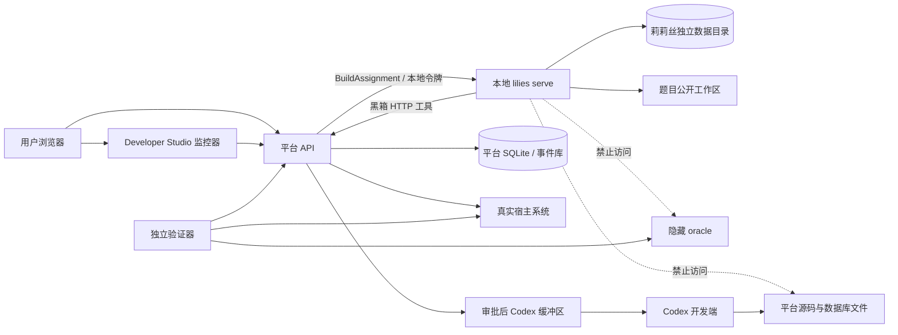
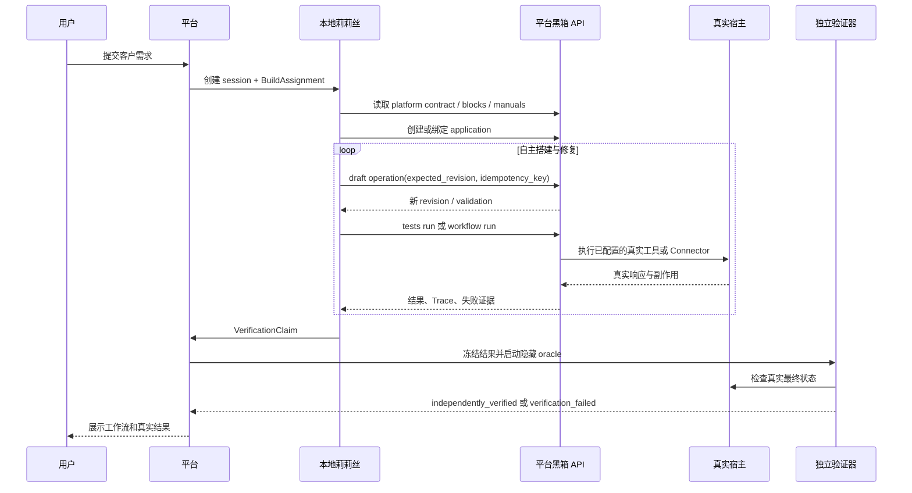
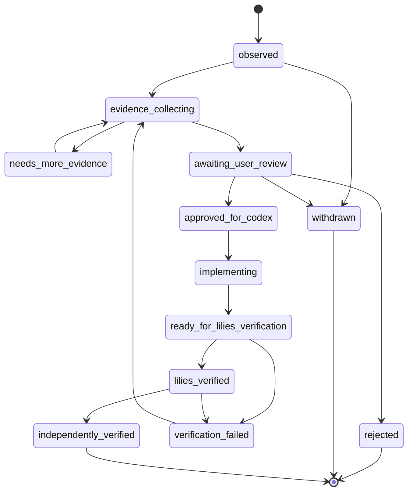
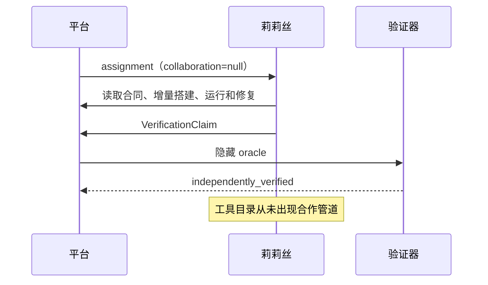
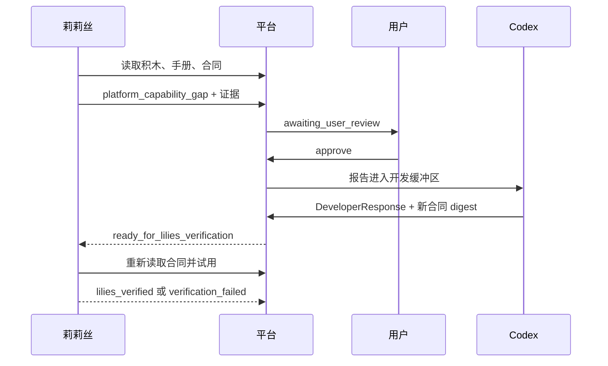
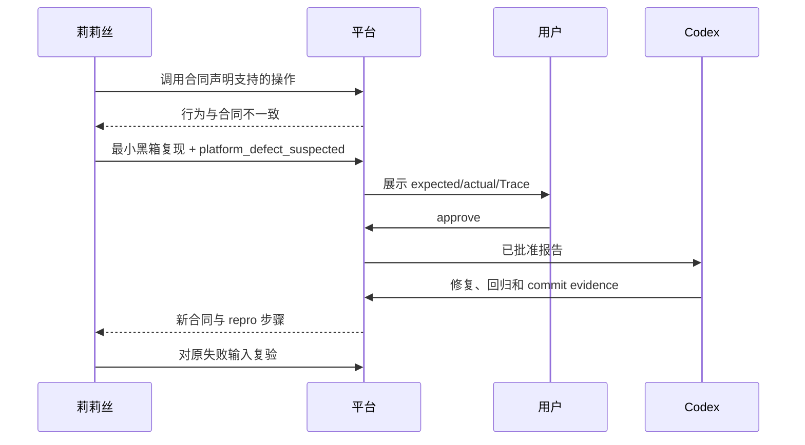
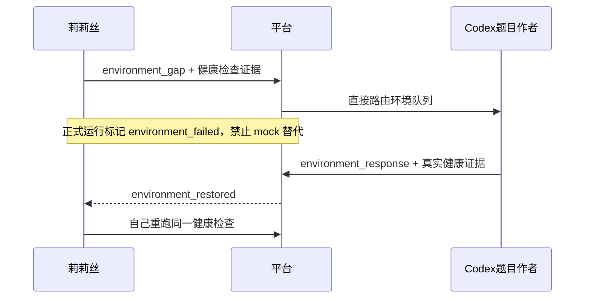
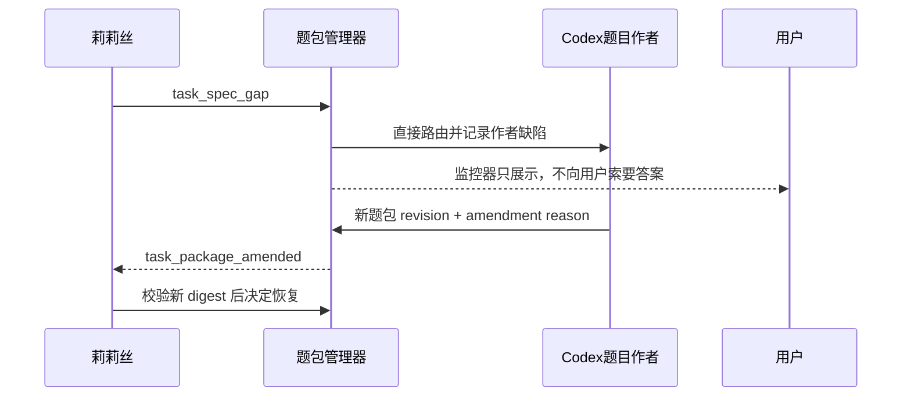
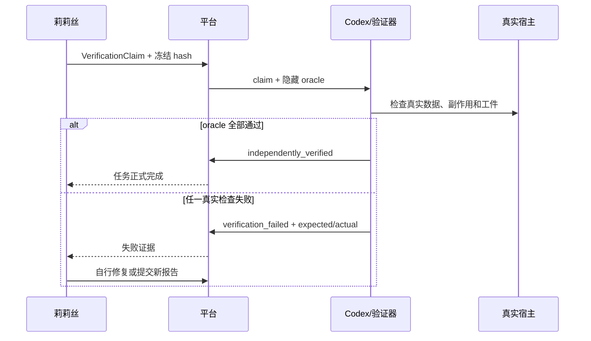
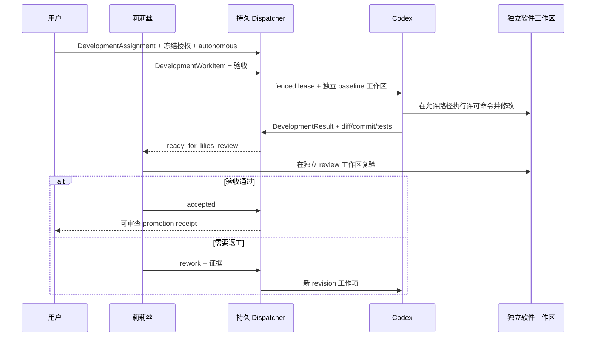

# v0.4.13 莉莉丝本地智能体、黑箱平台接耦、通用协同开发与临时实验管道展开实施总计划

| 字段 | 内容 |
| --- | --- |
| 文档状态 | 已批准实施基线 |
| 计划版本 | Draft 3 |
| 对应阶段任务 | `V04-13-T01` |
| 来源意图 | `PRODUCT-001`、`PRODUCT-005`、`PRODUCT-008`、`PRODUCT-015`、`PRODUCT-016`、`PRODUCT-017`、`ARCH-003`、`EVAL-003` |
| 权威来源 | 用户关于莉莉丝独立运行、黑箱搭建、可复用跨软件协同开发、可切换自主合作、题包责任和独立复验的直接指令 |
| 前置阶段 | `v0.4.12` 完成有限闭环清障并通过独立 Closure Audit |
| 批准依据 | 用户于 2026-07-22 批准原四包，并于 2026-07-24 明确批准按 assignment 授权的通用智能体、跨软件协同开发和逐条审批/自主合作开关 |
| 实施限制 | 严格按第 20 节顺序实施；产品目标、角色、审批权、黑箱边界和正式题目变化必须重新审批 |
| 归档去向 | v0.4.13 完成后移入 `docs/historical-designs/`，最终状态写回阶段报告 |

## 0. 执行摘要

本阶段的第一优先级不是“做一套能力上报系统”，而是把莉莉丝真正做成一个可以独立启动、持续对话、使用工具、保存上下文，并能通过黑箱平台接口搭建工作流的本地智能体。

莉莉丝本体与 Codex 同属通用智能体。她在 Builder assignment 中受黑箱合同限制，是为了验证平台公开能力，而不是因为她永久不能读取或修改代码。用户明确创建软件开发 assignment 后，莉莉丝可以获得该任务声明的源码工作区、搜索、命令、测试和版本控制工具；不同角色使用不同上下文、工作区和凭证，已经读取源码或隐藏答案的上下文不得作为黑箱 Builder 证据。

成熟产品路径固定为：

```text
平台收到用户需求
→ 平台连接本地莉莉丝
→ 莉莉丝读取平台公开的积木目录、手册和能力合同
→ 莉莉丝只通过平台公开 API 创建应用、增量修改草稿、试跑、验收和修复
→ 莉莉丝完成后由独立验证器检查真实业务结果
→ 平台向用户展示可运行工作流
```

本阶段同时把莉莉丝—Codex 的持久协作底座从工作流业务语义中解耦。显式 `collaborative_development` assignment 可以针对平台或其他授权软件创建任务、角色、工作区、工具、预算、租约、结果和复验记录，并选择逐条审批或自主交接。Developer Studio 暂时仍是主要监控适配器，但平台 application、Builder、题包和隐藏 oracle 不能成为通用协作核心的必需依赖。

正式实验继续使用更严格的报告管道。当莉莉丝在预检、规划、搭建、运行或验收中发现平台通用能力缺失或疑似实现错误时，它提交结构化证据；manual 模式由用户逐条批准，autonomous 模式按本题预先授权自动转发。Codex 修复平台并回传实现证据，莉莉丝重新读取黑箱能力合同，自行判断是否继续。自主合作只取消逐条交接点击，不会扩大代码目录、命令、网络、副作用或隐藏验证权限。

任何合作能力都不是莉莉丝的常驻默认工具。普通客户、普通聊天和未显式授权的软件任务在模型上下文、工具目录、线路 schema 和错误信息中均不得发现它。

本文是审批用总计划，不是任务来源。阶段任务仍来自 `v0.4.12` 阶段报告中的 `V04-13-T01`；本文只把该任务展开到可实施粒度。

## 1. 用户意图锁

以下条目是本计划的最高判错依据。任何后续设计、代码、测试或报告与之冲突时，必须修改后续产物，不能反过来解释这些条目。

| 意图 ID | 不可变意图 | 违反示例 |
| --- | --- | --- |
| `LILIES-I001` | 莉莉丝首先是本地独立智能体，平台是它连接和操作的外部黑箱 | 继续把内部 `WorkflowBuilder` 改名为莉莉丝 |
| `LILIES-I002` | 平台收到需求后把任务交给莉莉丝，由莉莉丝调用平台 API 搭建工作流 | 平台先搭好图，再让莉莉丝只写总结 |
| `LILIES-I003` | 莉莉丝的可见目录、工具和凭证由当前 assignment 角色决定；客户 Builder 与正式黑箱实验只能看到公开积木、手册、合同、草稿、运行和验收接口，显式开发任务可获得用户声明的软件工作区和开发工具 | 把 Builder 黑箱限制解释为莉莉丝永久不能改代码，或在同一黑箱上下文中临时挂载源码 |
| `LILIES-I004` | 工作流设计和配置错误由莉莉丝自行修改、试跑和复验 | Codex 直接替莉莉丝修改最终草稿 |
| `LILIES-I005` | 能力缺口可以在预检、规划、加积木、运行、验收或恢复阶段随时报告 | 只允许发布失败后上报 |
| `LILIES-I006` | 合作管道是任务级临时能力，普通状态下完全不可发现 | 把 `report_gap` 放进莉莉丝默认工具列表 |
| `LILIES-I007` | 平台通用能力缺失和疑似平台缺陷按任务合作策略路由：manual 逐条审批，autonomous 在用户预先授予的边界内自动转发 | 未声明自主策略或越出工作区/工具/网络授权时由 Codex 后台自动改代码 |
| `LILIES-I008` | 每道实验题默认人工审批，可在该题内切换自动转发；新题恢复人工审批 | 一次开启后永久自动批准所有报告 |
| `LILIES-I009` | 正式实验题条件不足是出题方责任，由 Codex 修订题包 | 莉莉丝向用户追问题目数据、环境或隐藏标准 |
| `LILIES-I010` | 普通客户模式仍允许莉莉丝进行选项式需求澄清 | 因实验模式规则而删除产品需求补全 |
| `LILIES-I011` | 外部环境不可用必须报告 Codex 解决，禁止私自换环境或换验证 | 用 mock 通过代替题目指定真实宿主失败 |
| `LILIES-I012` | 权限和高风险动作服从 assignment 的显式授权策略；可以预授权有界动作或逐次询问，但拒绝/越权不算平台缺功能 | 把 autonomous 合作当作无限工具权限，或把用户拒绝授权上报为能力缺口 |
| `LILIES-I013` | Codex 的“已修复”只是新证据，不是莉莉丝必须接受的命令 | 收到 `OK` 后不复查能力合同就继续 |
| `LILIES-I014` | 莉莉丝完成声明必须经过 Codex 使用隐藏 oracle 独立复验 | 以莉莉丝自己的测试报告宣布实验通过 |
| `LILIES-I015` | Codex 是正式题目的出题者和环境负责人，不是最终工作流代写者 | Codex 提供专用适配器、字段映射或最终画布 |
| `LILIES-I016` | 每道题、每次修订、每轮通信、运行和验证结果必须留档 | 只在聊天里保留总结，无法重放 |
| `LILIES-I017` | 莉莉丝形象是白发、闭眼、安静、白裙、赤足的小姑娘 | 使用与该设定不符或带有性化表达的视觉 |
| `LILIES-I018` | 首要交付始终是莉莉丝本身及其平台接耦；管道、监控和视觉只服务该目标 | 先做庞大治理后台，却没有可对话的莉莉丝 |
| `LILIES-I019` | 不恢复、编辑或使用已经被用户删除并禁止的 Lilies evolution Skill | 依赖 Skill 驱动本阶段执行 |
| `LILIES-I020` | 莉莉丝—Codex 协同开发必须是可跨软件复用的独立 assignment、API、CLI 和持久状态机，Developer Studio 只是当前适配器 | 把协作核心永久硬编码为 application、WorkflowBuilder、Paperless/InvenTree 或一个前端页面的内部功能 |
| `LILIES-I021` | 莉莉丝和 Codex 都是按角色授权的通用智能体；同一身份可以在不同隔离任务中承担 Builder、developer、reviewer 或 verifier，但权限不能跨上下文累加 | 因为身份名叫莉莉丝就禁止所有源码访问，或让看过 oracle 的上下文继续参加黑箱交付 |

## 2. 术语与三种运行模式

### 2.1 核心术语

| 术语 | 本文唯一含义 |
| --- | --- |
| 智能体/工作流生成平台 | 提供积木、画布、草稿、运行时、验收、发布、客户界面、连接器和治理的完整产品 |
| 莉莉丝 | 独立运行的具名本地通用智能体；在 Builder 角色负责平台工作流，在显式开发角色也可使用授权软件工作区和开发工具 |
| 平台黑箱合同 | 莉莉丝被允许读取和调用的版本化 HTTP API、积木手册、能力目录和错误语义 |
| 正式实验题 | Codex 预先准备完整题包、真实环境和隐藏 oracle 的可复现实验 |
| 合作底座 | 可被平台或其他软件任务复用的双向持久消息、任务、租约、审批/自主交接、结果和复验机制 |
| 正式实验管道 | 由合作底座承载、只在指定正式实验中注入的报告、平台补能和独立验证协议 |
| 协同开发任务 | 用户显式创建的跨软件开发 assignment，声明目标、参与角色、工作区、允许路径/命令/网络、副作用、预算和交接模式 |
| 能力报告 | 莉莉丝关于平台通用能力缺失或实现错误的结构化证据，不是普通聊天消息 |
| 题包缺陷 | 需求、夹具、环境、凭证、允许动作或成功标准不足，导致题目本身不可解 |
| 替代验证 | 未经题包预先授权，用 mock、其他宿主、简化输入或结构测试替代指定真实结果 |
| 隐藏 oracle | 莉莉丝及平台构建过程均不可读取、仅供独立验证器判定真实结果的检查程序和答案 |

### 2.2 普通客户模式

普通客户模式是成熟产品形态。客户输入可能不完整，莉莉丝可以通过平台已有的选项式需求补全获得业务角色、输入、输出、权限和验收信息。普通客户模式没有合作工具，也没有 Codex 等待在另一端。

### 2.3 正式实验模式

正式实验模式用于本阶段研发和股东会可复核实验：

1. Codex 必须在启动前准备完整题包、真实环境、夹具、凭证引用、允许动作、预算和隐藏 oracle。
2. 莉莉丝不能向用户索要题目条件。
3. 发现题目条件不足时提交 `task_spec_gap`，该次运行记为出题方缺陷。
4. 发现外部环境不可用时提交 `environment_gap`，不得进行替代验证。
5. 只有正式实验模式可以向 Builder 莉莉丝注入报告/验证管道。

### 2.4 显式协同开发模式

协同开发模式用于莉莉丝与 Codex 经常性改进平台或其他软件：

1. 用户创建独立 `DevelopmentAssignment`，不能复用或转换已有 customer/formal session。
2. assignment 固定 `workspace_grant`、允许路径、命令、网络主机、副作用、预算、截止时间和两个智能体的角色。
3. `manual` 由用户逐项批准交给另一智能体；`autonomous` 由持久 dispatcher 自动领取、执行、交回和复验。
4. 自主模式只自动化交接；任何扩目录、扩命令、扩网络、读取秘密或高风险副作用必须形成新的用户授权。
5. 每项工作在独立分支/工作区完成，以 diff、测试、提交和审查 receipt 交接；不得让两个智能体并发覆盖同一工作目录。
6. 该模式可以没有 workflow application、题包或 oracle；其软件工程结果单独报告，不进入企业工作流成功率。

## 3. 阶段入口与实施禁令

### 3.1 v0.4.12 有限清障

`v0.4.12` 尚未可靠闭环。开始 v0.4.13 产品实现前，只允许处理下列已知清障，不得把旧阶段扩成新路线：

| 清障 ID | 必须完成的事实 | 完成证据 |
| --- | --- | --- |
| `V0412-CLOSE-01` | OpenAPI URL 摄取抵御 DNS rebinding 和解析后地址变化，不存在检查时与使用时分离 | 安全实现、私网/重绑定测试和独立审查 |
| `V0412-CLOSE-02` | 至少一个符合原合同资格的 InvenTree 真实写合同通过；失败不能被排除出分母 | 真实宿主请求、响应和副作用证据 |
| `V0412-CLOSE-03` | 发布门禁纳入上述真实失败，任何失败都会阻止通过 | 机器可读 release gate 结果 |
| `V0412-CLOSE-04` | 响应包络语义有确定性测试，不只验证内部 schema | 聚焦测试和原始输出 |

只有新的独立只读审查判定 `PASS`，并且演进控制验证通过后，才开始下文的 v0.4.13 代码任务。

### 3.2 本文审批门禁

本文分四个审查包。所有审查包均为“批准”前：

- 不增加 `lilies` CLI。
- 不增加合作管道数据库表。
- 不增加 Studio 监控页面。
- 不运行正式业务实验。
- 不把本文标为已完成设计。

用户对任意段落提出纠偏时，直接修改本文并更新第 23 节修订记录；不叠加另一份互相冲突的计划。

## 4. 当前实现事实与目标差距

### 4.1 可复用事实

| 现有部分 | 已有能力 | 可复用方式 | 不能误称为什么 |
| --- | --- | --- | --- |
| `AgentRuntime` | 多轮模型循环、并行工具、预算、取消、上下文压缩、会话消息落盘 | 抽取为莉莉丝的智能执行内核 | 已经存在独立莉莉丝 |
| `Storage` | SQLite 会话、单调事件序号、JSONL 镜像、SSE 断点续读 | 复用事件模型并增加读者确认与可见性 | 已经存在可靠合作邮箱 |
| `PermissionBroker` | 工具执行前等待允许或拒绝 | 继续负责运行权限 | 能力报告审批 |
| `WorkflowBuilder` | 内部协调消息、积木手册、增量草稿工具、测试和修复循环 | 将工具语义公开为黑箱平台合同 | 可长期对话的莉莉丝 |
| `WorkflowStorage` | 应用、草稿 revision、幂等写、版本、Build、Run | 继续作为平台事实来源 | 莉莉丝自己的会话库 |
| 平台 API | 积木、手册、应用、草稿、测试、运行、Trace 和 SSE | 作为黑箱客户端基础 | 已经具有最小权限莉莉丝令牌 |
| Engineer Studio | Build/Edit/Test/Automation 与事件展示 | 增加开发协作监控入口 | 已经存在全局莉莉丝会话监控 |
| Claude Code 参考源码 | 远程会话、权限、工具池、终端 UI、恢复等行为参考 | 做行为对照与验收矩阵 | 可直接构建或可直接复制的依赖 |

### 4.2 关键缺口

| 缺口 | 当前后果 | 本阶段目标 |
| --- | --- | --- |
| CLI 只会启动平台 Uvicorn | 无法像 Claude 一样直接启动并与莉莉丝交谈 | 独立 `lilies serve` 与 `lilies chat` |
| AgentRuntime 与平台服务同进程组装 | 莉莉丝不具备独立生命周期 | 独立本地 daemon 和独立数据目录 |
| Builder 只有内部 coordinator 消息 | 平台外部不能在同一上下文持续交流 | 持久会话、消息和 assignment API |
| Builder 工具是 Python 内部调用 | 无法证明莉莉丝通过黑箱平台搭建 | 版本化平台合同与 HTTP 工具适配层 |
| 单一 API token | 无法区分用户、莉莉丝、Codex 和验证器 | 最小范围、任务级凭证 |
| SSE 只有事件 replay，没有读者 ack | 无法证明对端已处理消息 | 持久 cursor、ack 和幂等消费 |
| 没有报告审批状态机 | 平台能力报告可能越权流向 Codex | 用户门禁和 Codex 隔离缓冲区 |
| 没有题包/隐藏 oracle 边界 | 出题缺陷和莉莉丝失败混在一起 | 不可变题包、受保护 oracle 和独立判定 |
| 没有完整本地角色 UI | 用户无法监视合作上下文 | Developer Studio 协作监控器 |

### 4.3 Claude 式能力对照

| 能力 | 当前平台内核 | v0.4.13 处理 | 明确不照搬 |
| --- | --- | --- | --- |
| 多轮 agent loop | 已有 | 复用并为莉莉丝固定身份 | 不重新手写第二套循环 |
| 工具调用与结果反馈 | 已有 | 增加黑箱平台工具组 | 不给任意平台内部函数 |
| 会话落盘和恢复 | 部分已有 | 增加 daemon 重启恢复、assignment 状态 | 不承诺跨设备云同步 |
| 上下文压缩 | 已有 | 保留决策、工具证据、报告关联 ID | 不暴露模型私有思维链 |
| 权限请求 | 已有 | 与能力报告审批彻底分离 | 不把 bypass 作为实验默认 |
| MCP/Skill/子智能体 | 已有底座 | 保留但不作为首个实验通过条件 | 不恢复被禁用的演进 Skill |
| CLI/TUI | 不存在 | 实现可用流式终端 | 不复制 Claude Code 品牌和源码 UI |
| 远程/本地会话查看 | 仅简单 SSE | 平台和 CLI 可同时查看同一会话 | 首版不用 WebSocket |
| 开发者协作通道 | 不存在 | 实现可跨软件复用的显式协同开发 assignment，并以正式题报告管道作为受限适配 | 不做无 assignment、无授权边界的自主代码修改 |

## 5. 本阶段范围与非目标

### 5.1 必须交付

1. 独立本地莉莉丝 daemon、CLI、持续会话和重启恢复。
2. 平台与莉莉丝的本地配对和 BuildAssignment 协议。
3. 莉莉丝专用的最小权限黑箱平台工具组。
4. 任务级临时合作管道、持久消息、用户审批和 Codex 缓冲区。
5. Developer Studio 全局协作监控器。
6. 不可变题包、环境锁、受保护隐藏 oracle 和运行归档。
7. 一组不计产品成功率的管道故障注入测试。
8. 六个按能力族拆分、逐个执行且各自拥有 revision/分母/oracle 的真实项目；Paperless/InvenTree 为项目 1，通用平台补能另列。
9. 莉莉丝终端 ASCII 形象和平台低干扰呼吸背景。
10. 完整回归、真实模型证据、浏览器证据、独立复验和中文阶段报告。
11. 一个不依赖 workflow application/Builder 的通用协同开发 assignment、独立 API/CLI、任务工作项、双智能体租约/交接/复验和持久自主 dispatcher，并以非 Lilies 软件 fixture 证明复用。

### 5.2 明确不做

- 不允许承担客户 Builder 或正式黑箱实验角色的同一莉莉丝上下文读取或修改平台源码；显式 developer assignment 不受这条黑箱角色限制。
- 不在 manual 模式让 Codex 读取未审批报告；autonomous 模式必须由用户在本题或开发 assignment 上预先开启，且不能扩大操作授权。
- 不把合作管道开放给普通客户或普通莉莉丝会话。
- 不在本阶段建设完整企业多租户身份系统；只实现本地角色隔离所需的最小任务级凭证。
- 不以 WebSocket 重写现有 SSE。
- 不把 Claude Code 参考源码当作可直接编译依赖。
- 不以视觉形象替代 daemon、CLI 和黑箱工作流搭建。
- 不并行或乱序扩展非 HTTP 接口；在六项目组合内仍严格保持 Home Assistant WebSocket → ThingsBoard MQTT → Actual SDK/CLI。
- 不在正式实验失败时用 mock、人工图、专用适配器或结构测试抬高成功率。
- 不把跨软件协同开发结果计入平台生成企业工作流的成功率。

## 6. 角色、进程与信任边界

### 6.1 六个角色

| 角色 | 可以看到 | 可以执行 | 明确禁止 |
| --- | --- | --- | --- |
| 用户 | 完整操作上下文、报告正文、审批历史、Codex 回复、独立结论 | 授权高风险动作、批准/拒绝报告、切换本题审批模式、停止实验 | 读取隐藏 oracle 的答案细节 |
| 莉莉丝 | 当前 assignment 明确授予的工作区、工具合同、自己的会话和协作回复；Builder/formal 角色只见题包公开部分与平台黑箱合同 | Builder 角色搭建/修改/运行/验收工作流；developer/reviewer 角色可在独立软件工作区编辑、运行许可命令和复验 | 读取当前角色未授权的源码、平台 DB、隐藏 oracle 或另一智能体私有工作区；把开发上下文冒充黑箱结果 |
| 平台 | 工作流和运行事实、莉莉丝连接元数据、报告和审批状态 | 执行黑箱 API、持久化事件、实施权限门禁 | 代替莉莉丝决定最终工作流 |
| Codex | 当前 assignment 授予的软件工作区；正式实验 developer 只见题包公开部分、环境和按 manual/auto 策略路由的报告 | 协同开发任务中实现或审查软件工作项；正式实验中修题包、环境或通用平台能力并回传证据 | manual 模式读取未审批报告、在正式实验中隐藏成最终工作流、读取 oracle、伪造莉莉丝反馈 |
| 题包管理器 | 题目版本、夹具、环境锁、预算、允许动作 | 冻结版本、生成摘要、记录修订和作者缺陷 | 修改已冻结 revision |
| 独立验证器 | 隐藏 oracle、运行工件、平台最终状态和审计事件 | 判定通过/失败、输出差异 | 向莉莉丝泄漏 oracle，替莉莉丝修工作流 |

### 6.2 进程隔离



黑箱边界必须同时由三层保证：

1. **文件层**：莉莉丝 sandbox 只挂载题包公开目录，不挂载 Lilies 仓库、平台 data 目录和 oracle 目录。
2. **凭证层**：莉莉丝令牌只允许合同声明的 workflow scopes，未知 endpoint 默认拒绝。
3. **工具层**：模型工具注册表中只有平台黑箱工具；不存在读取宿主 Python 对象或执行平台数据库 SQL 的工具。

Codex 开发端也必须受进程边界约束。活动实验中的 Codex developer worker 只挂载源码工作区和环境管理入口，不挂载平台运行 data 目录、用户审批库或隐藏 oracle；它获取报告的唯一入口是 developer inbox API。最终独立复验使用另一个新鲜、只读 verifier 上下文，该上下文可以读取 oracle 和冻结运行结果，但不能修改平台源码。角色不能因“都是 Codex”而合并权限。

上述图描述正式实验角色，不是莉莉丝永久权限。协同开发模式另建不可转换的 development session：莉莉丝和 Codex 各自使用从同一冻结 baseline 派生的独立工作区，通过受控 diff/commit receipt 交接；工作区 broker 和执行器只读取 `DevelopmentAssignment` 中的授权，不能沿用正式题凭证、platform data 或 oracle。

### 6.3 最小权限 scopes

| Scope | 使用者 | 能力 |
| --- | --- | --- |
| `lilies.session:write` | 平台、CLI | 向本地莉莉丝会话发送消息或 assignment |
| `lilies.session:read` | 平台、CLI | 读取会话状态和 SSE |
| `lilies.permission:resolve` | 用户端 | 处理莉莉丝运行权限请求 |
| `workflow.catalog:read` | 莉莉丝 | 读取积木、手册、工具和平台合同 |
| `workflow.application:write` | 莉莉丝 | 创建指定应用 |
| `workflow.draft:write` | 莉莉丝 | 以 revision 和幂等键增量修改指定草稿 |
| `workflow.test:execute` | 莉莉丝 | 执行指定应用验收 |
| `workflow.run:execute` | 莉莉丝 | 运行、恢复、取消指定应用 |
| `workflow.artifact:read` | 莉莉丝 | 读取该 assignment 产生的工件 |
| `collaboration.report:write` | 实验会话中的莉莉丝 | 提交本任务能力、环境或题包报告 |
| `collaboration.response:read` | 实验会话中的莉莉丝 | 读取对本任务的开发回复 |
| `collaboration.approve` | 用户端 | 审批能力报告和切换本题模式 |
| `collaboration.developer` | Codex 开发端 | 租约和处理已批准报告 |
| `collaboration.verify` | 独立验证器 | 读取 claim、运行 oracle 并提交结论 |
| `development.assignment:read` | 莉莉丝、Codex、用户 | 读取当前协同开发目标、角色和授权摘要 |
| `development.work:write` | 莉莉丝、Codex | 在当前 assignment 创建工作项、结果、审查或返工记录 |
| `development.workspace:read` | 莉莉丝、Codex | 读取角色绑定的独立软件工作区 |
| `development.workspace:write` | assignment 指定 developer | 只修改允许路径并产生 diff/commit receipt |
| `development.process:execute` | assignment 指定 developer/reviewer | 只执行允许的 argv、cwd、timeout 和环境配置 |
| `development.dispatch:control` | 用户端 | 切换 manual/autonomous、停止 dispatcher 或处理扩权请求 |

首版 scope 是本地安全边界，不得宣传为完整客户 IAM、SSO 或生产多租户认证。

## 7. 成熟形态：本地莉莉丝与平台接耦

### 7.1 进程生命周期

新增独立命令 `lilies`，而不是继续让 `agent-platform` 同时冒充平台和莉莉丝。

| 命令 | 行为 | 退出条件 |
| --- | --- | --- |
| `lilies serve` | 在 `127.0.0.1:8765` 启动 daemon，打开自己的会话库和事件流 | 收到 SIGTERM、显式 stop 或不可恢复存储错误 |
| `lilies chat` | 连接 daemon，创建或恢复交互会话并流式显示回复 | 用户退出；daemon 保持运行 |
| `lilies chat --session <id>` | 恢复指定会话 | 会话不存在时明确失败，不新建同名会话 |
| `lilies sessions` | 列出会话、assignment、最后状态、更新时间 | 一次性命令 |
| `lilies attach <session-id>` | 只查看并可继续已有会话 | 用户退出 |
| `lilies status` | 显示 daemon、模型、平台配对和活动任务 | 一次性命令 |
| `lilies pair` | 生成十分钟有效的一次性本地配对码 | 码被兑换或过期 |
| `lilies stop` | 请求 daemon 有序停止；活动 turn 先标记取消 | daemon 完成落盘 |

固定默认：

- daemon 只监听 loopback；绑定 `0.0.0.0` 必须显式参数并显示安全警告，本阶段验收不使用公网绑定。
- 数据目录默认 `~/.lilies/`，开发测试可通过 `LILIES_DATA_DIR` 覆盖。
- daemon 信息写入 `~/.lilies/daemon.json`，权限必须为 `0600`，只含 PID、地址、启动时间和 daemon 公钥指纹，不含 token。
- `lilies chat` 找不到 daemon 时默认启动一个后台 daemon；`--no-start` 可要求只连接。
- daemon 重启后恢复 ready、waiting_permission、waiting_collaboration 和 error 会话；running turn 在重启时转为 `interrupted`，必须显式恢复，不能自动重放有副作用工具。

### 7.2 正常任务主路径



正常主路径不创建合作报告，也不要求 Codex 在线。

### 7.3 莉莉丝会话状态

| 状态 | 含义 | 可接受动作 |
| --- | --- | --- |
| `ready` | 可接受用户消息或 assignment | message、assignment、close |
| `running` | 模型/工具循环进行中 | inspect、cancel；禁止第二个并发 turn |
| `waiting_permission` | 等待高风险工具授权 | allow、deny、cancel |
| `waiting_collaboration` | 当前工作分支等待管道回复 | inspect、cancel；可继续无依赖分支 |
| `interrupted` | daemon 重启或进程异常中断 | resume、cancel |
| `error` | 本轮失败但会话可继续 | message、resume、close |
| `cancelled` | assignment 被取消 | inspect、close；不得自动恢复 |
| `completed` | 莉莉丝已提交完成 claim | inspect；等待独立复验 |
| `closed` | 会话只读归档 | read only |

每次状态迁移必须写入莉莉丝事件库。会话持久化至少包含：

- `session_id`、创建时间、最后更新时间、状态。
- 莉莉丝 agent 版本、模型 profile、系统身份版本。
- 消息和工具结果。
- 上下文压缩摘要及其覆盖到的事件序号。
- 累计 token、成本和工具次数。
- 当前 assignment 和平台合同 digest。
- 当前等待的 permission request 或 collaboration report。
- 最近确认的平台/管道事件 cursor。

### 7.4 本地配对协议

平台和 CLI 不能复用平台全局 `API_TOKEN` 访问 daemon。

#### `POST /local/v1/pairings/exchange`

请求：

| 字段 | 类型 | 规则 |
| --- | --- | --- |
| `pairing_code` | string | 一次性、十分钟有效、兑换后立即失效 |
| `client_name` | string | `platform`、`cli:<hostname>` 或可读名称 |
| `requested_scopes` | string[] | 只能从 daemon 允许列表选择 |
| `client_nonce` | string | 至少 16 字节随机值，防止重放 |

响应只返回一次：

| 字段 | 类型 | 规则 |
| --- | --- | --- |
| `client_id` | UUID | 持久客户端标识 |
| `access_token` | string | 仅本响应显示；daemon 只保存 hash |
| `granted_scopes` | string[] | 可能少于请求值 |
| `expires_at` | datetime/null | 平台配对默认 30 天，CLI 配对默认 24 小时 |
| `daemon_fingerprint` | string | 平台必须与 `daemon.json` 对照 |

重复兑换、过期码、非 loopback 来源和未知 scope 一律拒绝并留下安全事件。

### 7.5 莉莉丝本地公共 API

| 方法与路径 | Scope | 用途 |
| --- | --- | --- |
| `GET /local/v1/health` | 无，仅 loopback | daemon 存活、schema 版本，不返回会话或密钥 |
| `POST /local/v1/pairings/exchange` | 一次性配对码 | 交换客户端 token |
| `GET /local/v1/sessions` | `lilies.session:read` | 列出调用者可见会话 |
| `POST /local/v1/sessions` | `lilies.session:write` | 创建普通或平台会话 |
| `GET /local/v1/sessions/{id}` | `lilies.session:read` | 读取会话摘要 |
| `POST /local/v1/sessions/{id}/messages` | `lilies.session:write` | 发送普通对话消息 |
| `POST /local/v1/sessions/{id}/assignments` | `lilies.session:write` | 提交正式 BuildAssignment |
| `POST /local/v1/sessions/{id}/resume` | `lilies.session:write` | 恢复 interrupted/error/waiting 状态 |
| `POST /local/v1/sessions/{id}/cancel` | `lilies.session:write` | 取消活动 assignment |
| `POST /local/v1/sessions/{id}/permissions/{request_id}` | `lilies.permission:resolve` | 处理工具权限 |
| `GET /local/v1/sessions/{id}/events` | `lilies.session:read` | SSE，支持 `Last-Event-ID` |
| `POST /local/v1/sessions/{id}/acks` | `lilies.session:read` | 持久化该客户端已处理 cursor |

### 7.6 BuildAssignment 字段合同

`BuildAssignment` 使用 `extra="forbid"`，未知字段返回 422；同一 `assignment_id + idempotency_key` 重放必须返回原结果。

| 字段 | 类型 | 必填 | 语义 |
| --- | --- | --- | --- |
| `schema_version` | `"1.0"` | 是 | assignment 协议版本 |
| `assignment_id` | UUID | 是 | 全局稳定 ID |
| `idempotency_key` | string | 是 | 平台生成，不少于 16 字符 |
| `mode` | `customer | formal_experiment` | 是 | 决定能否向用户澄清 |
| `requirement` | string | 是 | 原始完整需求，不使用通用占位文本 |
| `business_context` | object | 是 | 客户角色、业务目标、输入、输出和限制 |
| `task_package` | TaskPackageRef/null | 实验必填 | `task_id`、`revision`、公开摘要 digest |
| `target` | ApplicationTarget | 是 | `create_new` 或指定 `application_id` |
| `platform` | PlatformAccess | 是 | base URL、合同 URL/digest、credential ref、scopes |
| `constraints` | AssignmentConstraints | 是 | deadline、turn、预算、网络和允许动作 |
| `fixture_refs` | ArtifactRef[] | 实验必填 | 只指向题包公开夹具 |
| `deliverables` | DeliverableSpec[] | 是 | 用户可见产物和格式 |
| `collaboration` | CollaborationAccess | 否 | 仅实验启用时才允许在线路和模型可见投影中出现；普通任务必须完全省略 |
| `created_at` | datetime | 是 | 平台创建时间 |

`PlatformAccess`：

| 字段 | 规则 |
| --- | --- |
| `base_url` | 题包允许的本地平台地址 |
| `contract_url` | 固定为 `/api/v1/lilies/platform-contract` |
| `contract_digest` | assignment 创建时的平台合同 SHA-256 |
| `credential_ref` | 指向 daemon 私密凭证库；模型和事件只能看到引用 |
| `scopes` | 精确列出本 assignment 权限 |
| `application_ids` | 可写应用白名单；创建后平台补写新 ID |

`AssignmentConstraints`：

| 字段 | 类型与默认 |
| --- | --- |
| `deadline_at` | 必填 UTC datetime |
| `max_turns` | 5-200 |
| `max_budget_usd` | 正数；实验必须设置 |
| `max_tool_calls` | 1-1000 |
| `network_policy` | `none | allowlist`；实验禁止 `full` |
| `allowed_hosts` | allowlist 模式必填 |
| `allowed_actions` | 题包授权的动作枚举 |
| `prohibited_actions` | 至少包含读取平台源码、oracle 和写题包 |
| `no_substitute_validation` | 正式实验固定为 `true` |

assignment 中绝不包含隐藏 oracle 路径、期望答案、平台源码路径或明文长期凭证。

## 8. 平台黑箱合同与莉莉丝工具

### 8.1 版本化能力合同

新增 `GET /api/v1/lilies/platform-contract`。它聚合公开能力，不返回数据库结构、Python 类名或内部文件路径。

响应固定包含：

| 字段 | 语义 |
| --- | --- |
| `schema_version` | 合同 JSON schema 版本 |
| `contract_version` | 单调平台合同版本 |
| `contract_digest` | 对规范化响应内容计算的 SHA-256 |
| `platform_version` | 平台发布版本 |
| `block_catalog_digest` | 积木定义摘要 |
| `manual_catalog_digest` | 手册摘要 |
| `tool_catalog_digest` | 运行工具目录摘要 |
| `operations` | 莉莉丝可调用操作、scope、请求/响应 schema、错误码 |
| `runtime_capabilities` | 可用环境、工件、Connector、模型和证据等级 |
| `known_boundaries` | 明确不支持、需授权或环境受限的通用边界 |
| `generated_at` | 生成时间；不影响 digest 的稳定字段需排除 |

莉莉丝启动 assignment 后必须先读取并校验 digest。开发修复完成后，Codex 回复只提供新 digest；莉莉丝必须重新拉取合同并判断是否真的获得所需能力。

### 8.2 黑箱工具组

莉莉丝模型只能获得以下平台工具。每个工具都是 HTTP 客户端，不可直接调用平台内部 Python service。

| 工具名 | 允许操作 |
| --- | --- |
| `platform_contract_get` | 读取合同、版本和已知边界 |
| `platform_block_search` | 搜索积木和手册 |
| `platform_block_get` | 读取一个积木 schema、端口、示例、反模式 |
| `platform_tool_catalog` | 读取工作流运行工具合同 |
| `platform_application_create` | 按 assignment 创建应用 |
| `platform_application_get` | 读取应用和版本摘要 |
| `platform_draft_inspect` | 读取草稿 revision、hash、图、测试和校验 |
| `platform_draft_apply` | 提交一个 `DraftOperation` |
| `platform_tests_run` | 运行当前草稿全部真实验收 |
| `platform_run_start` | 启动指定草稿或发布版本 |
| `platform_run_get` | 获取状态、输出、等待节点和错误 |
| `platform_run_resume` | 恢复 Human Input 或权限等待 |
| `platform_run_cancel` | 取消运行 |
| `platform_trace_get` | 获取结构化节点、工具和证据事件 |
| `platform_artifact_read` | 读取本 assignment 产生的工件元数据和内容 |
| `platform_publish` | 在验收门禁允许时发布不可变版本 |

`platform_draft_apply` 每次只接受一个既有 `DraftOperation`，必须携带 `expected_revision` 和唯一 `idempotency_key`。禁止提供“整图替换”“执行任意 Python”“直接写数据库”工具。

### 8.3 标准工具结果

所有黑箱工具返回同一外壳：

```json
{
  "ok": true,
  "operation": "platform_draft_apply",
  "request_id": "uuid",
  "status_code": 200,
  "contract_digest": "sha256:...",
  "data": {},
  "error": null,
  "evidence_refs": []
}
```

失败时 `error` 必须为：

| 字段 | 语义 |
| --- | --- |
| `code` | 稳定错误码，如 `revision_conflict`、`permission_required`、`unsupported_capability` |
| `message` | 人类可读原因 |
| `retryable` | 同输入重试是否可能成功 |
| `failure_owner` | `lilies | user_permission | task_author | environment | platform` |
| `expected` | 合同预期 |
| `actual` | 实际结果 |
| `evidence_ref` | 不含密钥的持久证据 |

`failure_owner` 只作为确定性初判。莉莉丝仍可结合手册、尝试历史和实际证据形成不同分类，但必须说明理由。

### 8.4 黑箱强制测试

1. 莉莉丝进程的工作区中不存在平台源码和数据库。
2. 使用莉莉丝 token 请求非合同 endpoint 得到 403。
3. 即使模型要求，也没有 SQL、内部 service、任意网络或整图替换工具。
4. 每次草稿写入都能在平台审计中关联 assignment、session、tool call 和 idempotency key。
5. 开发修复改变合同后旧 digest 失效；莉莉丝必须刷新。
6. 黑箱测试从独立进程发 HTTP 请求，不允许在 pytest 中直接注入 `WorkflowStore` 作为通过证据。

## 9. 莉莉丝身份、系统上下文与恢复

### 9.1 固定身份内容

莉莉丝的基础系统上下文必须明确：

- 她是本地运行的具名通用智能体，不是整个平台；Builder、developer、reviewer 等能力来自当前 assignment。
- 她的主要客户是需要真实 AI 化的传统企业，也允许单独报告个人/小团队泛化。
- Builder assignment 中她通过平台公开积木、运行和验收接口交付工作流，平台对该上下文是黑箱。
- developer assignment 中她可以读取和修改用户声明的软件工作区、运行许可工具；不能自行扩目录、命令、网络或副作用授权。
- 工作流设计错误由 Builder 莉莉丝自行修复；软件工作项按 assignment 的角色和交接状态处理。
- 正式实验中题目缺失和环境问题由出题方承担，结构验收、mock 或自己的声明不能替代真实业务结果。

合作说明和开发工具不得写入基础系统上下文。只有 formal assignment 显式携带 `collaboration` 或独立 DevelopmentAssignment 显式授予开发角色时，daemon 才追加对应任务说明并注册精确工具档案。普通 assignment 使用 `exclude_none` 投影，在线路数据、模型上下文和工具 schema 中完全省略相关字段；会话归档必须能证明普通会话从未看见协作或开发能力。

### 9.2 上下文压缩不变量

长会话压缩必须保留：

- 原始业务目标和题包 digest。
- 用户批准或拒绝的决定。
- 平台合同 digest 变化。
- 未解决报告 ID、分类、状态和因果父消息。
- 已尝试工作流路线及失败证据。
- 草稿 revision、content hash、测试 run 和业务 run ID。
- 禁止替代验证约束。

不得把完整密钥、模型私有思维链或隐藏 oracle 放入摘要。

### 9.3 daemon 恢复规则

| 中断位置 | 恢复行为 |
| --- | --- |
| 模型生成中 | 标记 turn interrupted，由用户或平台显式 resume |
| 只读工具中 | 可按同一 request ID 重新获取结果 |
| 草稿幂等写入中 | 先查询 idempotency 结果，禁止盲目重写 |
| 有副作用 Connector 中 | 查询 receipt/idempotency 状态，无法确认则等待人工，不自动重放 |
| 等待 permission | 恢复同一 request；旧授权不得套用到新输入 |
| 等待 collaboration | 从最后 ack cursor 重放 developer response |
| 已提交 VerificationClaim | 不再修改冻结草稿；等待独立结论 |

## 10. 临时合作管道

### 10.1 激活与不可发现性

正式实验管道按题目实例激活，生命周期不得超过题目运行和复验周期。通用协同开发使用独立 `DevelopmentAssignment` 和 `channel_kind=collaborative_development`，不得调用本节的题包、平台报告或 oracle 接口。

激活条件必须同时满足：

1. assignment 为 `formal_experiment`。
2. 题包显式设置 `collaboration_enabled: true`。
3. 平台为该 task revision 创建唯一 `channel_id`。
4. 用户已看到该题将启用开发合作管道。
5. daemon 收到只限该 channel 的凭证引用。

未激活时必须同时满足：

- BuildAssignment 的线路数据和模型可见投影中完全没有 `collaboration` 字段。
- 莉莉丝工具定义中没有任何 collaboration 工具。
- 系统上下文中没有管道说明。
- 平台拒绝该 session 向任意 channel 写入。
- 普通会话无法从错误信息推断管道 endpoint。

频道关闭后凭证立即失效；历史消息仍可只读归档。

协同开发 channel 的激活条件是：独立 development assignment 已经冻结、用户已确认授权摘要、两个角色工作区已经建立、任务选择 manual 或 autonomous、daemon 收到 assignment-scoped 凭证。它不能从 customer/formal session 转换，也不能让普通会话通过错误信息发现开发 endpoint。

### 10.2 分类与唯一出口

| 分类 | 触发条件 | 是否进合作管道 | 是否需用户批准 | Codex 可做什么 | 实验状态 |
| --- | --- | --- | --- | --- | --- |
| `task_spec_gap` | 题目缺输入、业务规则、夹具、凭证引用或成功标准 | 是，出题方路由 | 否，用户可见 | 只修订题包，不能借此改平台 | `task_author_failed` |
| `environment_gap` | 指定真实宿主、网络、容器、凭证或依赖不可用 | 是，环境路由 | 否，用户可见 | 只修环境并回传健康证据 | `environment_failed` |
| `workflow_design_error` | 现有积木和环境足够，但当前图、配置或测试设计错误 | 不形成能力报告，只写运行轨迹 | 否 | 不介入 | 莉莉丝继续修复 |
| `permission_request` | 工具真实可用，但动作需要用户授权 | 独立权限通道 | 是，权限审批 | 不介入 | 等待用户 |
| `platform_capability_gap` | 手册/合同没有满足需求的通用能力或运行环境 | 是，能力路由 | 是 | 获批后实现通用能力 | `waiting_collaboration` |
| `platform_defect_suspected` | 合同声称支持，但黑箱行为与合同或证据不一致 | 是，缺陷路由 | 是 | 获批后复现并修实现 | `waiting_collaboration` |
| `verification_claim` | 莉莉丝认为题目已经完成 | 是，验证路由 | 不需能力审批 | 只做独立 oracle 验证 | `awaiting_independent_verification` |

路由不可由自由文本关键词决定。莉莉丝提交枚举分类和证据，平台再按上表进行确定性路由。

表中“是否需用户批准”在 formal `manual` 模式表示逐条审批；在用户显式开启的 formal `auto_forward` 模式，证据完整的平台能力/缺陷报告自动进入 developer inbox。题包和环境责任仍确定性直达负责角色。任何工具运行权限、Human Input 和扩权请求使用独立策略，不因 auto-forward 自动获准。

### 10.3 莉莉丝允许使用的临时管道工具

只有激活会话注册三个工具：

| 工具 | 行为 |
| --- | --- |
| `collaboration_report_submit` | 提交题包、环境、平台能力或疑似缺陷报告 |
| `collaboration_updates_read` | 从最后 cursor 读取审批、题包修订、环境恢复或开发回复 |
| `collaboration_verification_claim` | 提交莉莉丝完成声明和冻结证据 |

工具不允许莉莉丝：

- 直接指定“发送给 Codex”绕过路由。
- 修改审批状态。
- 读取其他任务报告。
- 查看 Codex 源码 diff 之外的开发工作区。
- 关闭或重开 channel。
- 修改题包或隐藏 oracle。

### 10.4 通用协同开发合同

通用模式不能把 `BuildAssignment`、`CollaborationReport` 或 `VerificationClaim` 改名复用。新增独立合同：

| 合同 | 关键字段与语义 |
| --- | --- |
| `DevelopmentAssignment` | `assignment_id`、目标、软件标识、冻结 baseline、Lilies/Codex 角色、工作区 grant、允许路径/argv/host、副作用策略、预算、deadline、`approval_mode`、`execution_mode` |
| `DevelopmentWorkItem` | `feature | bug | refactor | test | review`、目标、验收、依赖、状态、租约 revision、父任务和不可变证据引用 |
| `DevelopmentResult` | 角色、baseline、commit/diff digest、实际命令、退出码、测试、限制、工件和可复验步骤 |
| `LiliesReview` | `accepted | rework`、逐项验收、复验命令、证据和下一轮要求 |

工作项状态固定为：

```text
proposed
→ awaiting_dispatch
→ leased
→ working
→ ready_for_lilies_review
→ accepted
→ closed
```

审查不通过时 `ready_for_lilies_review → rework → awaiting_dispatch`；租约过期回到 `awaiting_dispatch`。manual 模式等待用户 dispatch，autonomous 模式由持久 dispatcher 自动推进。无论哪种模式，扩权请求都暂停并等待用户。

通用开发工具使用单独档案，只在 development session 注册：

- `workspace_search`、`workspace_read`、`workspace_write`、`workspace_patch`；
- `process_run`，只接受 argv、允许 cwd、timeout、输出上限和干净环境；
- `git_status`、`git_diff`；提交和跨工作区 promotion 由可信 broker 完成；
- `development_work_submit`、`development_updates_read`、`development_review_submit`。

每个智能体在独立 baseline 派生工作区工作。核心 API/CLI 不得导入 `WorkflowStorage`、`WorkflowBuilder`、application、题包或 verifier；Developer Studio 只消费通用投影。

## 11. 管道数据合同

### 11.1 CollaborationChannel

| 字段 | 类型 | 规则 |
| --- | --- | --- |
| `channel_id` | UUID | 每个 task revision 唯一 |
| `channel_kind` | `formal_experiment | collaborative_development` | 创建后不可变；旧记录迁移为 formal |
| `task_id` | string | 与题包一致 |
| `task_revision` | integer | 创建后不可变 |
| `assignment_id` | UUID | 唯一绑定 |
| `lilies_session_id` | UUID | 唯一绑定 |
| `approval_mode` | `manual | auto_forward` | 默认 manual，仅本题有效 |
| `execution_mode` | `manual_dispatch | autonomous` | 默认 manual_dispatch；formal 或 development 都只能由用户在当前 assignment 显式切换 autonomous |
| `status` | ChannelStatus | `created | active | disconnected | closing | closed | archived` |
| `next_seq` | integer | 服务端单调递增 |
| `created_at` | datetime | UTC |
| `closed_at` | datetime/null | 关闭后不可写 |
| `retention_until` | datetime/null | 阶段归档前不得删除 |

### 11.2 CollaborationMessageEnvelope

所有报告、审批、回复和验证结论共用外壳：

| 字段 | 类型 | 规则 |
| --- | --- | --- |
| `message_id` | UUID | 全局唯一 |
| `channel_id` | UUID | 必须与凭证一致 |
| `seq` | integer | 服务端分配，频道内单调 |
| `message_type` | enum | `report | approval | task_amendment | environment_response | developer_response | verification_claim | verification_result | control` |
| `sender_role` | enum | `lilies | user | task_author | codex | verifier | platform` |
| `sender_id` | string | 审计标识 |
| `correlation_id` | UUID | 关联同一报告处理链 |
| `causal_parent_id` | UUID/null | 直接因果父消息 |
| `idempotency_key` | string | `channel + sender + key` 唯一 |
| `visibility` | enum | `user_only | user_and_lilies | approved_developer | verifier` |
| `payload_schema` | string | 负载 schema 名和版本 |
| `payload` | object | 通过 schema 校验 |
| `evidence_refs` | EvidenceRef[] | 只允许不可变证据引用 |
| `created_at` | datetime | 服务端时间 |

`seq` 和 `created_at` 不由发送者提供。任何重放只返回第一次写入的原消息。

### 11.3 CollaborationReport

| 字段 | 必填 | 说明 |
| --- | --- | --- |
| `report_id` | 是 | 稳定 UUID |
| `category` | 是 | 第 10.2 节枚举之一；不接受 `workflow_design_error` |
| `phase` | 是 | `preflight | planning | draft_mutation | run | acceptance | resume` |
| `severity` | 是 | `blocking | major | minor` |
| `summary` | 是 | 一句话说明阻塞事实 |
| `original_goal` | 是 | 不经改写的业务目标摘要 |
| `requirement_digest` | 是 | 对题包公开需求计算 |
| `platform_contract_digest` | 平台类必填 | 报告发生时所读合同 |
| `manuals_checked` | 平台类必填 | block/manual ID 与版本 |
| `attempted_routes` | 是 | 每次尝试的输入、结果和 evidence ref |
| `expected` | 是 | 题包或平台合同预期 |
| `actual` | 是 | 黑箱实际结果 |
| `reproduction` | 缺陷类必填 | 最小黑箱复现步骤，不含内部猜测 |
| `missing_contract` | 能力类必填 | 所需通用输入、输出、语义、错误和证据合同 |
| `blocking_scope` | 是 | 受影响模块和仍可继续的独立工作 |
| `workaround_considered` | 是 | 已考虑路线 |
| `workaround_loss` | 是 | 为什么替代会损害业务或证据 |
| `requested_outcome` | 是 | 题包修订、环境恢复或平台能力结果 |
| `confidence` | 是 | 0-1；低置信度不影响用户查看 |
| `secret_redactions` | 是 | 已脱敏字段列表 |

平台能力报告缺少 `manuals_checked`、`attempted_routes`、`expected`、`actual` 或证据引用时，先进入 `needs_more_evidence`，不得呈现“批准发送”按钮。

### 11.4 DeveloperResponse

Codex 完成平台通用修复后必须回传：

| 字段 | 说明 |
| --- | --- |
| `response_id` | 稳定 UUID |
| `report_id` | 对应已批准报告 |
| `outcome` | `implemented | not_reproduced | rejected_as_specific | needs_task_change` |
| `commit_sha` | 实现提交；未实现时为 null |
| `generic_capability_changes` | 面向平台合同的变化，不写项目专用补丁 |
| `new_contract_digest` | 实现后合同摘要 |
| `tests_run` | 命令、退出码、摘要、原始 evidence ref |
| `browser_or_live_evidence` | 适用时的真实证据 |
| `known_limits` | 仍不支持内容 |
| `reprobe_steps` | 莉莉丝应从黑箱执行的复查步骤 |
| `created_at` | 服务端时间 |

回复中出现 `OK` 字样没有任何状态效果。只有 schema 完整、报告仍在 implementing、提交和证据存在时，平台才能转到 `ready_for_lilies_verification`。

### 11.5 VerificationClaim

| 字段 | 说明 |
| --- | --- |
| `claim_id` | 稳定 UUID |
| `assignment_id` | 当前题目 |
| `application_id` | 最终应用 |
| `draft_revision` / `content_hash` | 冻结草稿 |
| `published_version` | 如已发布则填写 |
| `test_run_ids` | 莉莉丝执行的验收 |
| `business_run_ids` | 指定真实环境运行 |
| `artifact_refs` | Excel、报告、日志等 |
| `host_receipt_refs` | 真实宿主写回收据 |
| `resolved_report_ids` | 本题处理过的能力报告 |
| `remaining_limits` | 莉莉丝明确承认的限制 |
| `claim` | `ready_for_independent_verification`，没有直接 pass |

提交 claim 后平台冻结对应 draft hash。莉莉丝若再修改草稿，原 claim 自动失效并创建新 claim。

## 12. 状态机、审批和持久缓冲

### 12.1 能力报告状态



状态修改权限：

| 迁移 | 唯一允许角色 |
| --- | --- |
| observed → evidence_collecting | 莉莉丝 |
| evidence_collecting → awaiting_user_review | 平台 schema/证据检查 |
| awaiting_user_review → approved/rejected/needs_more_evidence | 用户 |
| approved_for_codex → implementing | 持有有效租约的 Codex |
| implementing → ready_for_lilies_verification | Codex 完整 DeveloperResponse |
| ready_for_lilies_verification → lilies_verified/verification_failed | 莉莉丝黑箱复查 |
| lilies_verified → independently_verified/verification_failed | 独立验证器 |

### 12.2 题包和环境报告状态

`task_spec_gap` 不进入用户批准状态：

```text
reported
→ routed_to_task_author
→ task_package_amended 或 rejected_with_evidence
→ lilies_rechecks
```

`environment_gap`：

```text
reported
→ environment_failed
→ routed_to_task_author
→ environment_restored 或 unresolved
→ lilies_health_checks
```

环境未恢复时不得转到能力报告，也不得使用替代验证继续计算正式成功率。

### 12.3 审批模式

| 行为 | manual | auto_forward |
| --- | --- | --- |
| 完整报告展示给用户 | 是 | 是 |
| 平台能力报告自动进入 Codex 缓冲区 | 否 | 是 |
| 缺证据报告自动转发 | 否 | 否 |
| 题包/环境报告直接路由 | 是 | 是 |
| 高风险运行权限自动批准 | 否 | 否 |
| 新题继承 | 否 | 否 |

切换 auto-forward 需要用户显式操作、二次确认，并写入包含操作者、时间、task revision 的审计事件。它不等同于模型工具权限 bypass。

协同开发另外具有 `execution_mode`：

| 行为 | manual_dispatch | autonomous |
| --- | --- | --- |
| 工作项自动取得租约并启动指定智能体 | 否 | 是 |
| 结果自动交回莉莉丝复验 | 否 | 是 |
| 扩大 allowed path/command/host/secret/side effect | 否 | 否 |
| 超预算、越权、冲突或复验失败继续盲跑 | 否 | 否 |
| 新 assignment 继承 | 否 | 否 |

用户可以在创建 assignment 时一次性选择 autonomous，从而让莉莉丝与 Codex 自主合作；系统仍在授权摘要、停止按钮和审计记录中保持可见。任何超出冻结授权的动作必须暂停并请求新的 grant。

### 12.4 Codex 隔离缓冲区

Codex 使用专用 endpoint，只能看到：

- 已批准的平台报告。
- 直接路由的题包和环境报告。
- 等待独立验证的 claim。

对于 `awaiting_user_review` 报告，Codex 列表 API 不返回正文、摘要、证据、数量差异或可推断业务内容。最多返回全局“存在待用户处理事项”的布尔健康指标，不能按 task 查询。

Codex 处理报告必须先获得租约：

- 默认租约 15 分钟。
- 5 分钟心跳续租。
- 同一报告最多一个活动租约。
- 租约过期回到 `approved_for_codex`，不丢消息。
- DeveloperResponse 写入要求 lease owner 和报告 revision 同时匹配。

## 13. 管道 API 与可靠性

### 13.1 莉莉丝端

| 方法与路径 | 行为 |
| --- | --- |
| `POST /api/v1/collaboration/channels/{id}/reports` | 提交分类报告；平台决定路由 |
| `GET /api/v1/collaboration/channels/{id}/events` | 莉莉丝 SSE，支持 `Last-Event-ID` |
| `POST /api/v1/collaboration/channels/{id}/acks` | 确认已处理 seq |
| `POST /api/v1/collaboration/channels/{id}/verification-claims` | 提交冻结完成 claim |

### 13.2 用户监控端

| 方法与路径 | 行为 |
| --- | --- |
| `GET /api/v1/studio/collaboration/channels` | 列出题目和频道状态 |
| `GET /api/v1/studio/collaboration/channels/{id}` | 读取上下文摘要、报告和 timeline |
| `GET /api/v1/studio/collaboration/channels/{id}/events` | 监控器 SSE |
| `POST /api/v1/studio/collaboration/reports/{id}/decision` | `approve | reject | needs_more_evidence` |
| `PATCH /api/v1/studio/collaboration/channels/{id}/settings` | 修改本题 approval mode |
| `POST /api/v1/studio/collaboration/channels/{id}/close` | 停止新消息并归档 |

审批请求必须携带 `expected_report_revision` 和 `idempotency_key`，避免双击或旧页面覆盖新证据。

### 13.3 Codex 开发端

| 方法与路径 | 行为 |
| --- | --- |
| `GET /api/v1/developer/collaboration/inbox` | 只列可见报告和 claim |
| `POST /api/v1/developer/collaboration/reports/{id}/lease` | 获取处理租约 |
| `POST /api/v1/developer/collaboration/reports/{id}/lease/renew` | 续租 |
| `POST /api/v1/developer/collaboration/reports/{id}/responses` | 回传 DeveloperResponse |
| `POST /api/v1/developer/collaboration/reports/{id}/lease/release` | 主动释放 |
| `POST /api/v1/developer/collaboration/claims/{id}/verification-results` | 独立验证器提交结论 |

### 13.4 持久化表

在平台 SQLite 增加独立表，不把合作消息塞入普通 event JSON 后再靠扫描重建：

| 表 | 关键约束 |
| --- | --- |
| `collaboration_channels` | task revision 和 assignment 唯一；approval mode 和状态 |
| `collaboration_messages` | `channel_id + seq` 主键；`channel + sender + idempotency` 唯一 |
| `collaboration_reports` | report payload、revision、分类、状态、路由 |
| `collaboration_approvals` | 每次决策追加，不覆盖历史 |
| `collaboration_reader_cursors` | `channel + reader_id` 唯一，保存 ack seq |
| `collaboration_developer_leases` | 单活动租约、owner、到期时间、revision |
| `collaboration_verifications` | claim、oracle digest、结论和差异 |
| `collaborative_development_assignments` | 软件、baseline、角色、授权、预算、manual/autonomous 和终态 |
| `collaborative_development_work_items` | 类型、依赖、状态、当前角色、revision 和验收 |
| `collaborative_development_leases` | work item 单活动租约、owner、fence、到期和恢复 |
| `collaborative_development_results` | diff/commit、命令、测试、工件、限制和证据摘要 |
| `collaborative_development_reviews` | 莉莉丝 accepted/rework 结论和复验结果 |

普通平台 events 只保存报告 ID 和状态变化，报告正文以访问控制表为事实来源。

### 13.5 通用协同开发 API

核心 API 不要求 workflow application：

| 方法与路径 | 行为 |
| --- | --- |
| `POST /api/v1/collaborative-development/assignments` | 创建严格 development assignment 和初始 channel |
| `GET /api/v1/collaborative-development/assignments/{id}` | 读取目标、授权、预算和状态 |
| `POST /api/v1/collaborative-development/assignments/{id}/work-items` | 莉莉丝或用户创建工作项 |
| `GET /api/v1/collaborative-development/assignments/{id}/events` | SSE/重放 |
| `POST /api/v1/collaborative-development/assignments/{id}/acks` | 持久 reader cursor |
| `PATCH /api/v1/collaborative-development/assignments/{id}/settings` | 切换 manual/autonomous；扩权使用独立 grant revision |
| `POST /api/v1/developer/collaborative-development/work-items/{id}/lease` | Codex/开发者取得 fenced lease |
| `POST /api/v1/developer/collaborative-development/work-items/{id}/results` | 提交 diff、测试和证据 |
| `POST /api/v1/collaborative-development/work-items/{id}/reviews` | 莉莉丝提交 accepted/rework |
| `POST /api/v1/collaborative-development/assignments/{id}/stop` | 停止 dispatcher、撤销凭证并保留归档 |

CLI 至少提供 `lilies develop`、`lilies develop status`、`lilies develop approve`、`lilies develop stop` 和独立 `lilies-collab worker`。平台可继续把这些投影到 `/developer/collaboration`，但其他软件不需要启动 WorkflowStorage 或创建 application。

### 13.6 可靠性规则

1. 服务端事务内分配 `seq` 并写消息；SSE 仅负责通知。
2. 客户端重连时以持久 ack 为准重放，不以最后渲染到屏幕为准。
3. 相同 idempotency key 和相同负载返回原消息；相同 key 不同负载返回 409。
4. 状态副作用使用 compare-and-set revision；重复审批不会重复转发。
5. 内存 subscriber 队列溢出只断开 SSE，不删除数据库消息；客户端重连补读。
6. 频道断开不自动判失败；超过题包 deadline 且仍不可达才形成 `channel_unavailable` 环境证据。
7. channel 关闭后拒绝新报告和回复，但允许读取、导出和独立验证完成已有 claim。
8. 所有负载在落盘前执行密钥、Authorization、cookie 和已登记 secret 字段脱敏。
9. 报告和题包证据保留到阶段归档完成；归档 manifest 保存文件 digest。

## 14. 六条必验时序

### 14.1 正常完成，不触发管道



### 14.2 预检发现缺少平台积木



### 14.3 运行中疑似平台实现错误



### 14.4 外部环境不可用



### 14.5 题目条件不足



### 14.6 莉莉丝声称完成后的独立复验



### 14.7 自主协同开发



dispatcher 崩溃后从持久租约、cursor、baseline 和结果 digest 恢复。它不得在没有可验证结果时猜测成功，也不得把 Codex 输出直接提升到用户软件；promotion 仍由可信 broker 检查 baseline、允许路径和用户配置的合并策略。

## 15. Developer Studio 合作监控器

### 15.1 信息架构

新增全局开发入口 `/developer/collaboration`。它属于 Developer Studio，不放入 Customer Runtime，也不塞进某个应用的普通运行页。它当前同时作为 formal 与 collaborative-development 的监控适配器；通用协作核心不依赖这个页面。

桌面布局：

| 区域 | 固定内容 |
| --- | --- |
| 左栏 | assignment kind、题目或软件、revision/baseline、莉莉丝会话、channel 状态、当前阻塞、未读数 |
| 中栏 | 按 seq 排列的需求、消息、工具调用、报告/工作项、审批/自动 dispatch、Codex 结果、莉莉丝复验 timeline |
| 右栏 | 当前报告或工作项证据、授权摘要、状态、路由、diff/测试、关联草稿/run/Trace |
| 顶栏 | daemon 连接、approval/execution mode、预算、deadline、停止实验或开发任务 |

移动端按“任务列表 → 时间线 → 详情”三层导航，不把三栏压成不可读卡片。

### 15.2 用户必须看见的上下文

“监视上下文”具体指：

- 题包公开需求和 revision。
- 莉莉丝与平台/CLI 的用户和 assistant 消息。
- 上下文压缩摘要及覆盖事件范围。
- 工具名称、脱敏输入、结果、耗时和 evidence ref。
- 平台合同 digest 与变化。
- 草稿 revision、测试结果、Run 和 Trace。
- 能力报告从发现到独立验证的完整因果链。
- Codex 的实现提交、测试和已知限制。
- 协同开发 assignment 的软件、baseline、允许路径/命令/网络、manual/autonomous、工作项 lease、diff 和莉莉丝 review。

监控器不展示或存储模型供应商的私有思维链。可观测的是输入、输出、工具决策、摘要和证据，不是隐藏 reasoning token 的逐字内容。

### 15.3 审批控件

平台能力报告详情只提供以下明确命令：

| 控件 | 结果 |
| --- | --- |
| 批准并发送 Codex | 状态进入 `approved_for_codex` |
| 要求补证据 | 写明缺失项，返回莉莉丝 `needs_more_evidence` |
| 拒绝 | 必填理由；报告结束但仍留档 |
| 本题自动转发 | 二次确认后将本题 `approval_mode` 设为 auto_forward |
| 恢复逐条审批 | 立即设回 manual |
| 开启自主合作 | 二次确认后把当前 assignment `execution_mode` 设为 autonomous；展示不会扩大的授权边界 |
| 恢复人工派发 | 停止新自动领取，已有 fenced worker 有序完成或取消 |
| 停止实验 | 取消 assignment，关闭写入，不删除历史 |

权限请求使用单独样式和按钮“允许一次”“拒绝”，不得与“发送 Codex”放在同一组件中。

### 15.4 可理解状态

每个状态同时显示：

1. 现在发生了什么。
2. 当前由谁处理。
3. 为什么没有继续。
4. 下一次状态改变需要什么证据或操作。

禁止只显示 `waiting`、`failed`、`unsupported` 或原始 JSON。

### 15.5 浏览器验收

浏览器自动化必须覆盖：

- 普通莉莉丝会话完全没有合作入口。
- 能力报告出现后用户能读到 expected、actual、尝试和证据。
- 用户批准前，模拟 Codex inbox 为空。
- 批准后报告进入 Codex inbox，双击批准只产生一次消息。
- “要求补证据”能回到同一莉莉丝会话。
- auto-forward 只作用于当前题，创建下一题时恢复 manual。
- daemon 断开和恢复时 timeline 不丢失、不乱序。
- DeveloperResponse 到达后显示 commit、测试和限制，而非只显示 `OK`。
- 独立验证失败时明确指出真实 expected/actual，并允许莉莉丝继续。
- 桌面和移动视口无重叠、溢出或不可达按钮。

## 16. 莉莉丝 CLI 与视觉人格

### 16.1 CLI 交互

CLI 第一屏只显示必要状态：

```text
莉莉丝
session: <short-id>   model: <model>   platform: connected/disconnected
state: ready

>
```

流式事件区分：

- 莉莉丝文字回复。
- 正在使用的工具及完成/失败。
- 权限等待。
- 合作管道等待和收到回复。
- 上下文压缩。
- turn 成本和预算。

CLI 不打印密钥、完整 Authorization、cookie 或隐藏 oracle 路径。默认不展开大型 JSON，用户可用 `/inspect <event-id>` 查看脱敏详情。

内置命令固定为 `/help`、`/status`、`/sessions`、`/resume`、`/cancel`、`/inspect`、`/exit`。工作流搭建仍通过模型工具，不把每个积木操作做成 CLI 命令。

### 16.2 ASCII 人格

终端启动时使用宽度不超过 28 列的原创 ASCII 轮廓，表达白发、闭眼、长睫毛、简洁白裙和赤足。必须满足：

- 不照搬任何现有角色或 Claude 标志。
- 不使用性化姿态、身体强调或幼态暧昧文案。
- 窄终端自动切换为姓名文字标识。
- `NO_COLOR`、非 TTY 和屏幕阅读器模式不输出装饰图。
- ASCII 只在启动和 `/about` 显示，不随每轮回复重复。

### 16.3 平台背景

莉莉丝形象作为平台第一视口的低干扰背景信号，不放进卡片：

- 白发、闭眼、安静站立或轻微呼吸，白裙和赤足。
- 透明度和对比度不得降低文字可读性。
- 动画只使用 opacity 和轻微 transform，不影响布局。
- `prefers-reduced-motion: reduce` 时完全静止。
- Customer Runtime 不展示 Developer 管道或 Codex 身份。
- 视觉任务排在功能闭环之后，不能延迟 daemon、黑箱 API 或真实实验。

## 17. 正式题包与留档合同

### 17.1 目录

每道题使用不可变 revision：

```text
docs/experiments/lilies-collaboration/<task-id>/<revision>/
  task.yaml
  requirement.md
  environment.lock
  fixtures/
    manifest.json
    public-inputs/
  allowed-actions.json
  budget.json
  archive-manifest.json
  protected/
    oracle/
    expected-state/
  runs/
    <run-id>/
      assignment.json
      messages.jsonl
      platform-events.jsonl
      collaboration.jsonl
      artifacts/
      result.json
```

`protected/` 进入 Git/归档，但绝不挂载到莉莉丝 workspace；测试验证其真实路径不出现在 assignment、消息、工具结果和平台合同中。

### 17.2 task.yaml

| 字段 | 规则 |
| --- | --- |
| `schema_version` | `1.0` |
| `task_id` | 稳定 ID，如 `EXP-LILIES-001` |
| `revision` | 正整数；内容变化必须加一 |
| `title` | 人类可读题名 |
| `cohort` | `enterprise` 或 `individual` |
| `customer_role` | 具体业务角色 |
| `business_goal` | 真实业务结果 |
| `source_projects` | repo URL、release/tag、commit/image digest、许可证 |
| `requirement_file` | 固定指向 `requirement.md` |
| `environment_lock_digest` | `environment.lock` 摘要 |
| `fixture_manifest_digest` | 公开夹具摘要 |
| `allowed_actions_file` | 允许和禁止动作 |
| `budget_file` | 时间、turn、模型成本、运行次数 |
| `deliverables` | 产物及格式 |
| `acceptance_summary` | 给莉莉丝可见的业务验收，不含隐藏答案 |
| `no_substitute_validation` | 正式题固定 true |
| `collaboration_enabled` | 本阶段正式题固定 true |
| `author` | Codex/task author 标识 |
| `created_at` | UTC |
| `parent_revision` | 首版为 null |
| `amendment_reason` | 修订时必填 |

### 17.3 environment.lock

必须精确记录：

- 宿主仓库 URL、release tag、commit SHA、容器 image digest。
- compose 文件 digest、端口、网络名和数据卷。
- 初始化和 seed 命令 digest。
- 健康检查 endpoint、预期状态和超时。
- 题包凭证的 secret ref 名称，不记录 secret 值。
- Python/Node/Docker 版本。
- 公开夹具文件 SHA-256。
- 故障注入开关及其恢复命令。

启动正式运行前，题包管理器执行所有健康检查并生成 `environment-ready.json`。没有这个文件不得创建 assignment。

### 17.4 allowed-actions.json

至少区分：

- 可读宿主对象和字段。
- 可写宿主对象和操作。
- 是否允许网络、模型、文件和 Connector。
- 哪些动作必须用户批准。
- 最大写入数量和 payload。
- 允许的补偿动作。
- 明确禁止读取平台源码、数据库、`protected/`、修改题包和安装未知适配器。

### 17.5 题包修订

已启动 revision 永不原地修改。发生 `task_spec_gap` 时：

1. 原 run 结束为 `task_author_failed`。
2. Codex 说明缺失为何属于题包责任。
3. 创建下一 revision，记录 parent 和 amendment reason。
4. 重新计算所有 digest。
5. 莉莉丝收到新 revision 后自行比较差异并决定是否复用原上下文。
6. 股东会结果同时报告题包作者缺陷次数，不从分母删除。

### 17.6 禁止替代验证

以下行为直接判定该次正式实验失败：

- 指定真实宿主不可用后改用 mock 并宣称正式通过。
- 删除失败或未运行用例。
- Codex 手写平台 manifest、字段 schema、映射代码或最终 WorkflowSpec。
- 将结构验收通过写成业务结果通过。
- 用人工修改宿主最终状态让 oracle 通过。
- 让莉莉丝读取 `protected/oracle` 或 expected state。

Mock 只允许作为题包预先声明的协议单测，并在报告中单列；它永远不能替代真实宿主结果。

## 18. 项目 1：首个正式企业实验

### 18.1 题目

| 字段 | 内容 |
| --- | --- |
| task ID | `EXP-LILIES-001` |
| 名称 | 供应商文档入库、采购匹配与库存系统交接 |
| 客户角色 | 制造企业采购运营人员和质量文件审核员 |
| Paperless-ngx | `v2.20.15`，固定 release 与 image digest |
| InvenTree | `1.4.2`，固定 release 与 image digest |
| 业务目标 | 自动处理供应商发票/质检证明，匹配物料和采购记录，分流异常，执行受治理写回，并生成可审计 Excel 对账单 |
| 实验性质 | 平台生成工作流真实交付实验；不是莉莉丝代码修复实验 |

项目依据：

- Paperless-ngx 是真实文档管理/OCR 系统，并提供版本化 REST API、上传、任务状态、搜索和自定义字段。
- InvenTree 是真实库存管理系统，并提供自描述 REST/OpenAPI、认证、权限、物料、订单、附件和导出能力。
- 两个宿主均在本地容器真实运行；不使用自造 API 镜像。
- Paperless-ngx 官方仓库与冻结版本：<https://github.com/paperless-ngx/paperless-ngx>、<https://github.com/paperless-ngx/paperless-ngx/releases/tag/v2.20.15>。
- InvenTree 官方仓库与冻结版本：<https://github.com/inventree/InvenTree>、<https://github.com/inventree/InvenTree/releases/tag/1.4.2>。
- 接口依据：<https://docs.paperless-ngx.com/api/>、<https://docs.inventree.org/en/latest/api/>。

### 18.2 给莉莉丝的公开需求

> 当 Paperless-ngx 出现新的供应商发票或质量证明时，读取文档和 OCR 文本，提取供应商、采购单号、物料号、批次、数量、日期和证书类型；与 InvenTree 中的供应商、物料和采购记录匹配。明确匹配且规则通过的记录写入受控元数据并建立可追溯关联；缺字段、低置信度、数量冲突或未知物料必须暂停给采购/质量人员选择，不得猜测或写入。重复文档不得产生重复副作用。最终生成一份 Excel 对账单，并保存每条记录的来源、判断、人工决定、写回收据和失败原因。

公开验收只说明业务规则和交付物，不向莉莉丝给出预期记录 ID、隐藏样本标签或 oracle 实现。

### 18.3 真实环境

Codex 作为出题方负责：

1. 启动固定版本 Paperless-ngx、PostgreSQL/Redis 和 InvenTree 真实服务。
2. 通过官方初始化方式创建测试租户、最小权限账号和 token。
3. 在 InvenTree seed 供应商、物料、采购单和采购行。
4. 向 Paperless-ngx 上传合成但业务结构真实的 PDF/扫描件。
5. 冻结两边 OpenAPI 和 API 版本，生成 digest。
6. 提供平台可读取的 endpoint 和 secret ref。
7. 准备故障注入代理，但不提供平台 Connector manifest 或映射。
8. 在 assignment 前证明所有健康检查通过。

Codex 不得：

- 编写 Paperless 或 InvenTree 专用平台适配器。
- 预写字段映射或工作流节点。
- 告诉莉莉丝哪些平台模块预计缺失。
- 修改莉莉丝生成的草稿。

### 18.4 数据集

公开训练/调试集与隐藏验收集使用不同文档和业务 ID，但共享同一公开业务规则。

| 场景 | 调试集 | 隐藏集 | 必须结果 |
| --- | ---: | ---: | --- |
| 明确匹配 | 8 | 12 | 正确关联并得到写回收据 |
| 缺字段或低 OCR 置信度 | 4 | 6 | 暂停人工，不猜测 |
| 重复文档 | 4 | 6 | 不产生重复写入 |
| 数量/物料冲突 | 4 | 6 | 阻止写入并解释冲突 |
| 临时宿主错误 | 2 | 3 | 有界重试，保持幂等 |
| 权限不足 | 2 | 3 | 明确权限失败，不上报能力缺口 |
| 合计 | 24 | 36 | 每条进入 Excel 和 Trace |

PDF 内容均为合成企业数据，不含个人真实敏感信息。扫描质量、版式和字段顺序必须变化，避免只对一个模板硬编码。

### 18.5 隐藏 oracle

独立验证器执行：

1. 查询 Paperless 文档、tag、自定义字段和任务状态。
2. 查询 InvenTree 供应商、物料、采购、附件/关联和审计变化。
3. 对照隐藏 expected state，逐记录检查匹配、阻断和人工分流。
4. 统计每个幂等键的宿主写入次数，重复场景必须为 0 个新增副作用。
5. 解析最终 `.xlsx`，检查 sheet、列、36 条数据、来源 ID、决策、收据和错误。
6. 校验 Excel 与两边真实最终状态一致。
7. 检查故障注入后的恢复和未授权动作不存在。
8. 检查运行 Trace 能把每个最终结果追溯到文档、节点、人工决定和宿主回执。

oracle 只输出 expected/actual 差异和证据摘要给平台，不回传隐藏答案文件。

### 18.6 通过标准

单次正式 run 必须全部满足：

- 36/36 隐藏文档进入结果和 Excel。
- 12/12 明确匹配记录关联正确。
- 6/6 低置信度记录进入 Human Input，未在人工决定前写宿主。
- 6/6 重复记录没有新增宿主副作用。
- 6/6 冲突记录被阻止并给出正确冲突字段。
- 3/3 临时错误在题包上限内恢复，写入仍为 exactly-once 效果。
- 3/3 权限不足按权限问题处理，没有伪报平台能力缺口。
- 所有允许写入都有可验证 receipt；禁止写入数量为 0。
- Excel 可打开、字段完整、行数和宿主最终状态一致。
- 没有 Codex 专用适配器、字段映射或人工草稿修改。
- 所有能力报告、开发回复和重试可以从归档重放。

可靠性要求：平台能力稳定后，使用三个独立隐藏 seed 连续运行三次，三次都满足上述安全和幂等标准；非安全的抽取字段准确率每次不得低于 95%，且任何低置信度项必须正确分流。

### 18.7 预算和停止

| 预算 | 上限 |
| --- | --- |
| 莉莉丝 build/repair turns | 120 |
| 莉莉丝模型成本 | 20 USD |
| 单次 assignment 墙钟时间 | 3 小时 |
| 黑箱平台工具调用 | 800 |
| 同一能力报告补证据轮次 | 3 |
| 正式隐藏运行 | 稳定后 3 次 |

超预算、deadline 到期或同一证据不变地重复上报三次时，运行停止并如实记为失败/未完成；不能为了得到通过而删除分母。

### 18.8 实验指标

分别报告，不混成单一“成功”：

- 题包作者缺陷次数和修订次数。
- 莉莉丝需求理解和工作流规划质量。
- 自动接口发现与字段映射覆盖。
- 首次可执行草稿耗时、turn、token 和成本。
- 草稿修复轮次及每轮失败类型。
- 莉莉丝主动发现的真实平台缺口数、误报数和发现阶段。
- 用户审批等待时间与 auto-forward 影响。
- Codex 平台修复耗时、代码范围和回归证据。
- 修复后莉莉丝恢复同一上下文的成功率。
- 工作流真实业务结果、重复性和人工介入。
- p50/p95、吞吐、CPU、内存和故障恢复；只有功能通过后才与人工/原流程比较。

管道协议单测、莉莉丝代码任务和 Codex 修平台成功不得进入该企业工作流成功率分母。

### 18.9 模型出口与 Token 监控

充值、余额核对和历史账本检查不需要模型调用。Provider 出口默认失败关闭；
平台和本地 daemon 只有在 `MODEL_EGRESS_ENABLED=true` 时才能发出真实模型
HTTP，T01H runner 还必须收到单次命令行 `--enable-model-egress`。仅启动平台、
daemon、调度器、恢复器或 runner 而未满足这两个条件时，不得消耗 provider
Token。

只读监控同时检查进程、发布的 schedule trigger、到期 durable job、可恢复
Local Lilies assignment、等待恢复的 daemon turn、自主协同开发 assignment 和
provider cost reservation，并从 Platform Harness、Local Lilies checkpoint 与
协同开发 receipt 汇总以下维度：

- `stage`、provider、model、task/session/assignment/run/node；
- input、output、cache、reasoning、total token；
- model call、usage record、无 usage 回执的未知调用；
- 配置价格估算成本；不得冒充 provider 账单。

正式 T01H run 每 5 秒默认写入私有的
`monitoring/token-monitor.latest.json` 和 append-only
`monitoring/token-monitor.jsonl`，两者权限均为 `0600`。监控失败不得打开模型
出口；未知 usage 不得记成已确认的零 Token。

### 18.10 六项目组合与迭代边界

用户于 2026-07-25 纠正了“题包 revision 被误解为项目进度”的组织方式。
T01H 仍是单一阶段任务，但其客户结果分母现在由六个真实项目组成：

| 顺序 | 项目 ID | 能力族 | 真实宿主 | cohort |
| ---: | --- | --- | --- | --- |
| 1 | `EXP-LILIES-001` | 文档/OCR、采购匹配、Excel、宿主写回 | Paperless-ngx + InvenTree | enterprise |
| 2 | `EXP-LILIES-002` | 企业 RAG、权限过滤、引用、知识更新 | BookStack | enterprise |
| 3 | `EXP-LILIES-003` | 事件驱动、持续监控、跨系统自动化 | Home Assistant | individual/small facility，单列 |
| 4 | `EXP-LILIES-004` | ML/DL 推理、threshold、人工复核、模型监控 | ThingsBoard CE | enterprise |
| 5 | `EXP-LILIES-005` | 结构化数据、文件工件、客户系统交付 | Actual Budget | individual/small business，单列 |
| 6 | `EXP-LILIES-006` | 预测、约束优化、排程/补货决策 | ERPNext | enterprise |

组合机器事实来源为
`docs/experiments/lilies-collaboration/portfolio-v04-13-t01h.json`。项目选择
锁定后必须满足：

1. 项目严格逐个执行；上一个项目未独立闭环，不启动下一个项目题包。
2. 每个项目拥有独立 revision chain、Builder context、environment、seed、
   budget、oracle、attempt archive 与结果分母。
3. `EXP-LILIES-001/1` 至 `/14` 是项目 1 的十四次迭代，不是十四个项目；
   需要修题包时从 `/15` 继续。项目 2–6 均从 `/1` 开始。
4. Home Assistant WebSocket → ThingsBoard MQTT → Actual SDK/CLI 的接口顺序
   不变；实验者仍不得预写 adapter、mapping、webhook handler 或 SDK wrapper。
5. 企业项目 1/2/4/6 与泛化项目 3/5 分开报告，不得混合平均。
6. 任一失败、超预算、环境失败或未完成 attempt 均留在对应项目分母；其它
   项目、mock、结构验收或组合平均不得覆盖它。
7. T01I 只有在六项目分别通过后才开始；T01J 与版本 Closure Audit 顺序不变。

通用平台补能由
`docs/experiments/lilies-collaboration/platform-capability-gaps.json` 单独登记。
只有项目运行中产生、证据完整并按冻结协作策略路由的报告才能形成
`CAP-LILIES-*` 实现工作项。每项记录来源项目/revision/attempt/digest、通用性
证明、实现 diff、平台测试、独立 review 和受影响项目的新 revision 重跑。
该通道固定 `enterprise_denominator=false`；宿主专用 adapter、字段映射、预制
最终图、oracle 泄漏或只通过能力单测的结果均不得登记为客户成功。

## 19. 管道资格测试

这些测试只证明协作基础设施和跨软件复用能力，不进入 `EXP-LILIES-001` 产品分母。

| 测试 ID | 场景 | 必须结果 |
| --- | --- | --- |
| `PIPE-Q01` | 普通 customer session | 工具和提示词均不存在合作管道 |
| `PIPE-Q02` | 正式题注入管道 | 只能访问绑定 channel |
| `PIPE-Q03` | 莉莉丝提交完整能力报告 | manual 模式进入 awaiting_user_review |
| `PIPE-Q04` | Codex 在审批前查询 | inbox 不含报告正文或可推断元数据 |
| `PIPE-Q05` | 用户重复点击批准 | 只产生一条 approved 消息和一个队列项 |
| `PIPE-Q06` | 报告缺 evidence | 进入 needs_more_evidence，不能批准 |
| `PIPE-Q07` | auto-forward 当前题 | 完整报告自动路由，权限请求仍不自动批准 |
| `PIPE-Q08` | 创建下一题 | approval mode 恢复 manual |
| `PIPE-Q09` | SSE 断开 100 条消息后重连 | 从 ack cursor 完整、按序、无重复恢复 |
| `PIPE-Q10` | subscriber 内存队列溢出 | 断线但数据库消息不丢 |
| `PIPE-Q11` | 相同 idempotency key 重放 | 同负载返回原记录，不重复副作用 |
| `PIPE-Q12` | 相同 key 不同负载 | 409，原记录不变 |
| `PIPE-Q13` | Codex 租约过期 | 报告回到可租约状态，消息不丢 |
| `PIPE-Q14` | DeveloperResponse 只写 `OK` | schema 拒绝，不唤醒莉莉丝 |
| `PIPE-Q15` | 新合同 digest 到达 | 莉莉丝先刷新合同，再决定恢复 |
| `PIPE-Q16` | 题目缺失 | 直接路由题目作者，不向用户提问 |
| `PIPE-Q17` | 真实环境不可用 | 正式 run environment_failed；mock 不计通过 |
| `PIPE-Q18` | 权限被拒绝 | 分类为 permission，不形成平台 gap |
| `PIPE-Q19` | 莉莉丝 claim 但 oracle 失败 | 状态 verification_failed，任务不完成 |
| `PIPE-Q20` | 报告含 token/cookie | 落盘和 UI 中均被脱敏 |
| `PIPE-Q21` | channel 关闭 | 新写入 409/410，历史仍可读取 |
| `PIPE-Q22` | daemon 重启等待回复 | 恢复同一 session/report/cursor |
| `PIPE-Q23` | Codex developer 尝试直接读取平台 data/oracle | 文件未挂载或权限拒绝，只能使用获批 inbox |
| `PIPE-Q24` | 创建非工作流软件 `DevelopmentAssignment` | 不需要 application、Builder、题包或 oracle 即可建立独立 Lilies/Codex 角色和持久 channel |
| `PIPE-Q25` | 莉莉丝承担 developer/reviewer 角色 | 只在显式 development session 获得搜索、许可命令、Git diff 和测试工具；formal/customer 工具目录不变 |
| `PIPE-Q26` | manual 与 autonomous 切换 | manual 等待 dispatch；autonomous 跨 Codex 实现和莉莉丝 review 自动推进；新 assignment 恢复 manual |
| `PIPE-Q27` | autonomous worker 请求越权路径/命令/host/副作用 | dispatcher 暂停并形成授权请求，目标工作区和原 grant 不变 |
| `PIPE-Q28` | 平台服务与 Studio 不启动 | 独立 API/CLI 在任意授权 Git fixture 完成 work item、结果、返工/接受和归档 |

资格测试必须包括属性测试或循环故障注入，至少分别重复 100 次 idempotency、reconnect、lease 和 concurrency 场景，不能只测一条 happy path。Q24-Q28 使用一个非 Lilies、非 workflow 的小型 Git fixture，并至少记录一次受限真实莉莉丝—Codex交接；它只证明协同开发底座，不证明企业工作流产品成功。

## 20. 实施工作包

以下均是 `V04-13-T01` 的展开子任务，不是从 current-design 产生的新路线。

### 20.1 `V04-13-T01A`：本地莉莉丝内核、daemon 与 CLI

| 字段 | 内容 |
| --- | --- |
| 来源意图 | `LILIES-I001`、`I002`、`I018`、`PRODUCT-001` |
| 前置 | v0.4.12 Closure Audit 通过；本文四包全部获批 |
| 具体改动 | 从平台组装中抽出可复用 agent core；新增莉莉丝身份配置、独立数据目录、daemon API、配对和 CLI |
| 主要边界 | core 可被平台与莉莉丝复用；莉莉丝 service 不导入 WorkflowStorage、Builder 或平台 DB |
| 公共接口 | 第 7 节命令、local API、session 状态和 pairing schema |
| 禁止捷径 | 不把现有 Uvicorn CLI 改名；不以一次模型调用代替循环；不共享平台 token/data dir |
| 验收 | CLI 可持续对话、工具可用、会话跨 daemon 重启恢复、权限可等待、预算/取消生效 |
| 证据 | 单元/集成测试、真实模型 bounded run、CLI transcript、进程重启证据 |

完成定义：用户可以在终端运行 `lilies chat`，连续多轮交流，关闭 CLI 后重新 attach；平台尚未接入也不影响莉莉丝会话存续。

### 20.2 `V04-13-T01B`：平台黑箱合同与工具客户端

| 字段 | 内容 |
| --- | --- |
| 来源意图 | `LILIES-I002`、`I003`、`I004`、`ARCH-003` |
| 依赖 | T01A |
| 具体改动 | 新增 versioned platform contract、task-scoped token、HTTP 工具 adapter、统一错误外壳和审计关联 |
| 复用 | 现有 block/manual/application/draft/test/run/trace API |
| 公共接口 | 第 8 节 contract endpoint、工具列表、scope、result/error schema |
| 禁止捷径 | 不给内部 Python service；不允许整图 JSON；不挂载源码；不预写专用适配器 |
| 验收 | 独立莉莉丝进程只用 HTTP 从空应用搭出可运行最小工作流并修复一次失败 |
| 证据 | 进程边界测试、403 scope 测试、draft 审计、合同 digest 漂移测试 |

完成定义：测试可删除平台进程内所有 Builder 对象，莉莉丝仍能仅凭合同和 API 完成最小工作流。

### 20.3 `V04-13-T01C`：平台到莉莉丝的 assignment 接耦

| 字段 | 内容 |
| --- | --- |
| 来源意图 | `LILIES-I001`、`I002`、`I010`、`PRODUCT-008` |
| 依赖 | T01A、T01B |
| 具体改动 | 平台保存 daemon pairing；创建 BuildAssignment；把应用、Build、莉莉丝 session 关联；在 Studio 展示状态 |
| 默认路由 | 配对 daemon 可用时使用 local Lilies；无 daemon 时明确提示，不静默切 legacy Builder |
| 兼容 | 既有 Builder 保留为显式“旧 Builder”开发选项，正式实验禁止 fallback |
| 公共接口 | Assignment schema、平台 connection/status endpoint、session event proxy |
| 禁止捷径 | 不由平台先生成草稿；不把 legacy Builder 结果塞回莉莉丝会话 |
| 验收 | 从平台输入需求后新应用立即可见，莉莉丝 session 和 application/build 可双向定位 |
| 证据 | API 测试、浏览器路径、daemon 不可用/重连路径 |

完成定义：用户从平台启动莉莉丝后能在监控中看到同一会话，并在应用列表看到莉莉丝实际创建的项目。

### 20.4 `V04-13-T01D`：合作管道持久化、路由和审批

| 字段 | 内容 |
| --- | --- |
| 来源意图 | `LILIES-I005` 至 `I014` |
| 依赖 | T01C |
| 具体改动 | 新表、message envelope、report schema、状态机、reader cursor、审批、auto-forward、Codex lease |
| 公共接口 | 第 10-13 节全部 collaboration API |
| 禁止捷径 | 不用普通日志扫描充当队列；不在审批前给 Codex；不让权限审批混入 |
| 验收 | PIPE-Q01 至 Q23 全部通过，无 mandatory xfail |
| 证据 | 数据库迁移测试、并发/断线/重放测试、访问控制测试 |

完成定义：频道在平台或 daemon 重启后无消息丢失；同一报告从发现到回复的因果链可以完整导出。

### 20.5 `V04-13-T01E`：Developer Studio 监控器与 Codex 开发端

| 字段 | 内容 |
| --- | --- |
| 来源意图 | `LILIES-I007`、`I008`、`I013`、`PRODUCT-008` |
| 依赖 | T01D |
| 具体改动 | 全局监控页面、timeline、证据详情、审批、task mode、daemon 状态、developer inbox CLI/API |
| Codex 接入 | 提供机器可读 inbox/lease/respond 命令；不宣称 Codex 永久在线 |
| 禁止捷径 | 不只显示 raw JSON；不在 Customer Runtime 暴露开发内容；不展示私有思维链 |
| 验收 | 第 15.5 节全部浏览器路径和 Codex 未审批隔离测试通过 |
| 证据 | 桌面/移动截图、控制台/网络错误、键盘可达性、API 原始结果 |

完成定义：用户可以在一个页面看懂莉莉丝为何停下、谁在处理、证据是否充分、批准后 Codex 做了什么、莉莉丝如何复验。

### 20.6 `V04-13-T01F`：题包、环境锁、归档和隐藏验证器

| 字段 | 内容 |
| --- | --- |
| 来源意图 | `LILIES-I009`、`I011`、`I014`、`I015`、`I016`、`PRODUCT-015` |
| 依赖 | T01D |
| 具体改动 | task package schema/validator、immutable revision、workspace mount filter、environment preflight、run archiver、oracle runner |
| 公共接口 | task.yaml、environment.lock、archive manifest、verification result schema |
| 禁止捷径 | 不把 oracle 放入 assignment；不原地改 revision；不删除失败 run |
| 验收 | 故意泄漏 oracle、改旧 revision、缺健康证据、替代 mock 均被拒绝 |
| 证据 | schema 测试、文件权限测试、digest 漂移、归档重放 |

完成定义：另一位只读审查者可从 archive 重建题目、环境、通信和最终判定，莉莉丝无法读取答案。

### 20.7 `V04-13-T01G`：管道资格测试与可复用协同开发

| 字段 | 内容 |
| --- | --- |
| 来源意图 | 第 19 节、`LILIES-I020`、`LILIES-I021`、`PRODUCT-017` |
| 依赖 | T01A 至 T01F |
| 具体改动 | 完成 Q01-Q23 的正式管道资格、100 次并发/断线故障注入；新增独立 DevelopmentAssignment/WorkItem/Result/Review、工作区 broker、受限开发工具、manual/autonomous dispatcher、平台中立 API/CLI 和 Q24-Q28 |
| 禁止捷径 | 不把这些测试计入平台业务成功率 |
| 验收 | Q01-Q28 全部通过；reconnect/idempotency/lease/concurrency 各 100 次零丢失/零重复副作用；非 Lilies 软件 fixture 在无 application/Builder 情况下完成 manual 与 autonomous 协作，越权失败关闭 |
| 证据 | machine-readable qualification bundle、独立 CLI、非平台 fixture diff/tests、受限真实 Lilies-Codex handoff |

### 20.8 `V04-13-T01H`：六个真实项目与独立通用平台补能

| 字段 | 内容 |
| --- | --- |
| 来源意图 | `LILIES-I002` 至 `I016`、`LILIES-I020`、`LILIES-I021`、`PRODUCT-010` 至 `PRODUCT-017`、`SCENARIO-004` 至 `SCENARIO-011`、`EVAL-003` |
| 依赖 | T01G |
| 具体改动 | 锁定六项目 registry 和各项目 manifest；项目 1 保留 revision 1–10，项目 2–6 各自从 revision 1 开始；严格逐个真实启动；每个 revision 内保持连续 Builder 上下文；按冻结策略处理证据完整的通用能力报告；Provider 默认断路且真实 run 需要单次显式放行，runner 持久记录按阶段 Token/成本快照 |
| 动态缺口 ID | 每个获批通用报告在独立 ledger 生成 `CAP-LILIES-<short-id>`，验收来自报告的 missing_contract，不进入任何客户分母 |
| Codex 边界 | 只能实现通用能力并回传证据；不得代写工作流或项目专用 adapter |
| 禁止捷径 | 不预先根据当前积木缺口偷跑实现；先由莉莉丝实际发现，再按已冻结的 manual/auto 策略路由；auto 不得绕过工具和副作用授权 |
| 验收 | 项目 1 使用第 18.6 节 oracle；项目 2–6 使用各 manifest 冻结后的独立业务 oracle；六项目必须分别通过，若预算内未通过则如实 fail |
| 证据 | 组合与项目 manifest、每项目完整题包/revision chain/会话/报告/runs/oracle/指标包，以及独立 CAP-LILIES 来源、diff、测试、review 和受影响项目重跑 |

动态缺口工作包固定模板：

| 字段 | 规则 |
| --- | --- |
| 来源 report | 必填且已按 manual 批准或按本题 autonomous 策略自动路由 |
| 通用能力合同 | 直接复制已路由报告的 missing_contract |
| 影响范围 | 不得含任一宿主或项目 ID 的专用分支 |
| 实现方案 | 由 Codex形成并在用户监控中可见 |
| 回归 | 通用单元测试 + 原复现 + 至少一个非来源项目/合约样本 + 受影响客户项目的新 revision |
| 返回 | 完整 DeveloperResponse |
| 关闭 | 莉莉丝复验和最终独立 oracle 都通过 |

### 20.9 `V04-13-T01I`：人格视觉与产品整合

| 字段 | 内容 |
| --- | --- |
| 来源意图 | `LILIES-I017`、`I018` |
| 依赖 | T01H 已获得至少一次端到端结果 |
| 具体改动 | CLI ASCII、平台背景、状态文案、reduced motion、Customer/Developer 边界 |
| 禁止捷径 | 不使用外部角色资产；不因视觉修改功能状态；不把管道暴露给客户 |
| 验收 | 终端宽/窄/NO_COLOR、前端 desktop/mobile/reduced-motion |
| 证据 | 终端快照、浏览器截图和可访问性检查 |

### 20.10 `V04-13-T01J`：发布门禁、独立审查和归档

| 字段 | 内容 |
| --- | --- |
| 依赖 | T01A-I 全部达到各自声明证据 |
| 具体改动 | 中文阶段报告、机器 release gate、claim ceiling、design/workingon/evidence 归档 |
| 独立审查 | 新上下文只读审查用户意图锁、diff、测试和实验全分母 |
| 禁止捷径 | partial/not_run/environment_failed 不算完成；不得删除失败 |
| 验收 | Closure Audit pass、版本规模 pass、演进控制 pass |
| 证据 | closure review、release gate JSON、Q01-Q28/协同开发/企业实验 archive digest、提交 SHA |

## 21. 测试与证据计划

### 21.1 后端确定性测试

拟新增聚焦测试：

- `tests/test_v04_13_lilies_local_service.py`
- `tests/test_v04_13_platform_blackbox_contract.py`
- `tests/test_v04_13_assignment_bridge.py`
- `tests/test_v04_13_collaboration_pipeline.py`
- `tests/test_v04_13_task_packages.py`
- `tests/test_v04_13_independent_verification.py`

必须覆盖模型之外的状态、权限、恢复、幂等、路由、可见性和失败语义。所有 mandatory case 必须实际运行，不接受 xfail。

### 21.2 真实模型测试

至少执行：

1. 终端三轮普通对话，含一次工具调用和一次上下文恢复。
2. 平台提交一个最小 BuildAssignment，莉莉丝增量搭建、测试、故意修复一个失败。
3. 管道预检能力报告、用户批准、DeveloperResponse、莉莉丝复验的 bounded scenario。
4. EXP-LILIES-001 正式实验。

每次记录 provider、model、预算、实际 token/cost、命令、session ID、平台合同 digest 和结果。API key 不得进入证据。

### 21.3 前端

```text
cd platform/frontend
npm run lint
npm run build
node scripts/v04_13_collaboration_browser.mjs
```

浏览器脚本保存每个关键状态截图、控制台错误、失败请求、横向溢出、焦点可达性和可见文案。

### 21.4 全量门禁

```text
.venv/bin/python -m ruff check platform/backend/src/agent_platform tests scripts
.venv/bin/python -m pytest -q
cd platform/frontend && npm run lint && npm run build
docker compose config --quiet
.venv/bin/python scripts/validate_evolution_control.py
.venv/bin/python scripts/run_v04_13_release_gate.py
```

release gate 必须包含真实实验结果，不得只包含单元测试。

### 21.5 证据等级与声明

| 结果 | 最多允许声明 |
| --- | --- |
| 只有单元测试 | 管道/接口候选实现 |
| daemon + 真实模型 | 莉莉丝本地交互与恢复在受控环境通过 |
| 黑箱最小 Build | 莉莉丝可通过公开 API 搭建简单工作流 |
| EXP 单次部分通过 | 复杂企业题发现了具体边界，不得称可靠交付 |
| EXP 单次全过 | 指定环境的一次完整交付 |
| 三个隐藏 seed 全过 | 指定 Paperless/InvenTree 任务的受控重复可靠性 |
| 客户生产观测 | 本阶段不达到，不得宣传 |

## 22. 故障模式与固定处置

| 故障 | 固定处置 |
| --- | --- |
| daemon 不可达 | 平台显示连接失败，保留 assignment；正式实验不 fallback 到 legacy Builder |
| pairing token 泄漏 | 立即撤销 client，关闭 channel，安全事件入档 |
| 平台合同 digest 不符 | 莉莉丝停止写操作，重新读取；仍不符则报平台 defect |
| 草稿 revision 冲突 | 重新 inspect 并基于新 revision 决策，不盲重试旧 patch |
| 平台返回未知错误 | 保存 request ID 和 Trace，先按 defect suspected 收集证据 |
| collaboration SSE 断开 | 继续可独立工作；受影响分支等待，按 cursor 重连 |
| Codex 租约持有者崩溃 | 租约过期重新可领，不重复报告 |
| DeveloperResponse 测试失败 | 不转 ready_for_lilies_verification |
| 莉莉丝拒绝新能力 | 保存原因，回到 evidence_collecting，不强制 resume |
| 题包需要修订 | 原 run 记 task_author_failed，新 revision 重启 |
| 环境长期不可恢复 | 正式实验失败并保留证据，不用替代宿主 |
| oracle 泄漏 | 整个 run invalid，换全新隐藏 seed 和凭证 |
| 独立验证失败 | 冻结差异，莉莉丝自行修复或重新上报 |
| 用户停止 | 取消 turn/run、撤销 channel 凭证、保留只读归档 |
| 预算耗尽 | 停止模型调用，结果 partial/failed，不假装完成 |

## 23. 上线、兼容与修订

### 23.1 功能开关

| 开关 | 初始值 | 转为默认的条件 |
| --- | --- | --- |
| `LILIES_LOCAL_AGENT_ENABLED` | false | T01A-C 确定性与浏览器验收通过 |
| `LILIES_COLLABORATION_ENABLED` | false | T01D-G 全部通过 |
| `LILIES_COLLABORATIVE_DEVELOPMENT_ENABLED` | false | T01G Q24-Q28、独立 CLI 和越权反例通过 |
| `LILIES_AUTONOMOUS_COLLABORATION_ENABLED` | false | manual/autonomous 状态机、持久 dispatcher、预算/停止/扩权失败关闭和受限真实交接通过 |
| `LILIES_LOCAL_BUILDER_DEFAULT` | false | EXP 至少一次完整 oracle 通过且用户批准 |

正式实验启动脚本显式开启本地 agent 和 formal collaboration；协同开发另行开启。即使全局开关为 true，普通 assignment 没有 task-level access 时仍不得注册协作或开发工具。

### 23.2 旧数据

- 现有 AgentRuntime session 不自动迁移为莉莉丝 session。
- 现有 application、draft、version、run 保持兼容。
- 新 collaboration 表只追加，不修改旧事件含义。
- 旧 Builder 保留到本阶段关闭；正式实验不可使用。
- 若最终未达到默认切换条件，平台继续明确显示“本地莉莉丝实验性”，不能静默混用两条构建链。

### 23.3 修订记录

| Draft | 日期 | 状态 | 修改 |
| --- | --- | --- | --- |
| 1 | 2026-07-21 | 待审批 | 首次完整展开：本地莉莉丝、黑箱合同、临时管道、监控器、题包、真实实验和工作包 |
| 2 | 2026-07-22 | 已批准实施基线 | 用户批准按总计划执行；A-D 四个审批包全部通过，进入 v0.4.12 有限清障 |
| 3 | 2026-07-24 | 已批准合同修订 2 | 用户确认莉莉丝与 Codex 均为按 assignment 授权的通用智能体，批准跨软件可复用协同开发和逐条审批/自主合作开关；当前优先级仍为通过真实项目补全平台能力 |
| 4 | 2026-07-25 | 已批准实现路线偏移 | 用户明确当前补能没有人类监控，要求关闭人类监管并由智能体间自行协作。T01H formal report 继续使用 `auto_forward`；task-local operational permission 只对与 task/revision/assignment/session/request/input digest 全绑定且位于冻结 `work`/`artifacts` 前缀的 `workspace_write`/`workspace_patch` 自动 allow。业务 Human Input、宿主 403、connector、网络、秘密、预算、oracle、side-effect grant 和 formal relay 安全边界不变；当前 formal channel 没有伪造 `execution_mode=autonomous`，由当前父智能体通过正式 API 承接协作链。 |
| 5 | 2026-07-25 | 已批准实现路线偏移 | 用户在充值前要求确认没有后台工作流自动消耗 Token，并要求查看莉莉丝各环节 Token。Provider 出口改为默认失败关闭，T01H runner 需双重显式放行并保存只读阶段快照；冻结 parent revision 9 的 revision 10。企业需求、预算、无人值守 task-local permission、宿主副作用、隐藏 oracle 与稳定 seed 验收不变。 |
| 6 | 2026-07-25 | 已批准合同修订 3 | 用户确认应以约六个不同能力族的真实项目逐个推进，并将迭代归入对应项目、通用补能单列。T01H 因此锁定六项目组合；EXP-LILIES-001 revision 1–10 原样保留为项目 1 历史，项目 2–6 各自从 revision 1 开始；企业与泛化 cohort 分开，Home Assistant WebSocket → ThingsBoard MQTT → Actual SDK/CLI 顺序不变。 |
| 7 | 2026-07-25 | 已批准实现路线偏移 | 两个 revision 10 post-recharge 真实运行都没有产生宿主请求、XLSX、receipt、合法 report/claim 或 oracle；第二个运行三次 report 均因本地 schema 校验失败，平台正确拒绝其虚假且不完整的 formal archive。通用 T01D 报告工具仅新增裁剪后的 validation path/type/message，经两名只读评审确认不属于 CAP-LILIES 客户能力。行为源码变化使旧冻结基线陈旧，因此保留全部 r10 失败并冻结 parent revision 10 的 revision 11；企业题、fixture、oracle、预算和验收不变，从 seed 101 全新重跑。 |
| 8 | 2026-07-25 | 已批准实现路线偏移 | revision 11 seed-101 在服务器未接受 durable formal completion evidence 时以普通 prose 结束模型循环，并错误宣称业务完成；宿主请求、正式工件、report、claim、archive 和 oracle 均为 0。通用 daemon 因此只对 `formal_experiment` 增加一次确定性 ID、持久、exact-replay、同 turn 且受原累计预算/截止时间约束的协议续接。它不改变题面、权限、验收、宿主副作用或 CAP 准入，也不列举项目具体缺口；保留 r11 失败并冻结 parent revision 11 的 revision 12，从 seed 101 全新重跑。 |
| 9 | 2026-07-25 | 已批准实现路线偏移 | revision 12 seed-101 在 19 次模型调用后请求用户已授权的 task-local `workspace_write`；runner 把 task ID、request UUID 和完整 input digest 直接拼接成超过 bridge schema 128 字符上限的 permission decision idempotency key，平台正确返回 422，未发生宿主写入。该通用 runner 缺陷不属于 CAP-LILIES；保留 r12 失败并冻结 parent revision 12 的 revision 13，只将 task/revision/assignment/session/request/input-digest 的规范绑定哈希成有界确定性 key，题面、权限边界、预算、验收和 oracle 不变。 |
| 10 | 2026-07-26 | 已批准实现路线偏移 | revision 13 seed-101 的两次 task-local permission 均以 bounded key 获得 200，证明 r12 runner 缺陷已修复；但莉莉丝最终保留三节点静态占位工作流，71 次模型调用、80 次本地工具、10 次 workflow run 与 8,893,085 tokens 后仍为宿主零请求、无真实 XLSX/artifact/receipt/publish/report/claim/oracle。它明确承认缺少宿主连接和动态输出，却把历史 draft run 冻结为 archive intent；intent 仅返回 `awaiting_daemon_completion`，daemon 完成后 durable archiver 才拒绝，原 turn 已无法修复或提交完整 capability report。保留 r13 失败；只修通用 fail-late formal archive intent 边界，使公开可判定的不完整证据在 turn 仍可继续时失败，不改变题面、权限、预算、宿主、oracle、CAP 准入或验收。 |
| 11 | 2026-07-26 | 已批准实现路线偏移 | 通用归档意图校验已移入 bridge assignment lock，并在不可变 reserve 前由平台推导完整 current-draft test/business run 集、当前业务运行的全部登记 artifact/host receipt、必需 deliverable media-type 数量，以及 Connector write execution-operation 回执分母。公开缺口以稳定 409 返回并可在同一 turn 用新幂等键修复；durable archiver 在 daemon 完成后重复同一检查。首轮只读审查拒绝仅检查空集合的实现，修正后第二轮判定 PASS；113 项相关回归及 HTTP 同 turn 修复通过。冻结 parent revision 13 的 revision 14；题面逐字节不变，fixtures、oracle、预算、权限、宿主、CAP 准入和验收不变。 |
| 12 | 2026-07-26 | 已批准实现路线偏移 | revision 14 seed-101 暴露生产装配顺序缺陷：`create_app` 在 `LocalLiliesBridge` 实例创建前尝试注入归档 validator，当时对象仍为 `None`，实际 bridge 因而冻结了 artifact/receipt 为空的 intent。莉莉丝在 92 次模型调用、13,741,955 tokens、11 次 workflow run 后只运行七条记录子集，宿主仍零请求、无工件/回执/发布/报告/oracle，并在错误 durable wait 中结束。保留 r14 失败；revision 15 仅通过 bridge 构造参数注入同一 `FormalRunArchiveCoordinator` validator，并由 production `create_app` 回归和只读独立审查确认。题面与 r14 逐字节不变，fixtures、oracle、预算、权限、宿主、CAP 准入和验收不变。 |
| 13 | 2026-07-26 | 已批准实现路线偏移 | revision 15 seed-101 在 10 次模型调用、624,339 tokens 后请求写入 `work/cbc.json`。第一次 relay 只到 `tool.requested` event 472；daemon 随后原子提交 `waiting_permission` 与 `permission.requested` event 478。runner 读到 waiting 后未再次同步 relay，Studio 投影尚无 event 478，因而错误终止为 `unattended_permission_rejected`。宿主请求、工件、回执、报告、归档预检和 oracle 均为 0；r15 没有验证 production archive preflight。保留 r15 失败；通用 runner 只在已观察到同 assignment `waiting_permission` 后增加一次 relay 同步屏障，仍仅从脱敏 Studio 投影决定精确 task-local workspace 请求，其余权限继续 fail-closed。题面、预算、宿主、oracle、CAP 准入和验收不变。该修复以 revision 16 冻结，150 项聚焦回归、Ruff、组合/演进验证和只读独立审查通过。 |
| 14 | 2026-07-26 | 已批准实现路线偏移 | revision 16 seed-101 的 post-wait relay 同步已在真实运行中生效：event 991 被 relay/ack，且 `work/test-input.json` 的精确 task-local 权限自动允许。第二次 `workspace_write` 携带 12,873-byte 公开 debug 数据；Studio 通用 8 KB 投影将整个 redacted input 替换为 digest-only，连同安全的顶层 `path=work/debug-records.json` 一起丢失，runner 因无法证明冻结写入范围而正确 fail-closed。该 run 共 31 次模型调用、4,207,838 tokens、$0.59269924，宿主请求、工件、回执、报告、归档预检和 oracle 均为 0。保留 r16 失败；只修通用监控投影，使 oversized permission 保留脱敏、有界、决策必需的顶层授权元数据而不暴露 bulk content，不改变题面、权限、预算、宿主、oracle、CAP 准入或验收。 |
| 15 | 2026-07-26 | 已批准实现路线偏移 | oversized permission 的通用 Studio 投影现仅在输入已被降为 digest-only、原始与脱敏 path 完全一致、类型为字符串且长度不超过 1,000 时保留顶层 path；bulk/private/credential 内容、超长或非字符串 path、普通 tool 投影继续省略。runner 仍只从 Studio 读取，并继续独立执行 task/revision/assignment/session/request/input-digest、工具白名单、canonical path、deny segment 和 `work|artifacts` 前缀检查。全新只读安全审查判定 PASS，审查建议的 1000 字符边界和 ordinary-tool 反例已补；161 项组合与相关回归及 Ruff 通过。冻结 parent revision 16 的 revision 17，题面逐字节不变，公开记录除 revision binding 外相同，24 个公开 PDF 逐字节相同；fixtures、oracle、预算、宿主、CAP 准入和验收不变。 |
| 16 | 2026-07-26 | 已批准实现路线偏移 | revision 17 seed-101 在 58 次模型调用、9,662,104 tokens、$1.35627702 和 draft revision 33 后，本地 Lilies 的精确 `get_session` 读取在 `clients` 表触发 `sqlite3.OperationalError: disk I/O error`。平台收到 502 后正确将 assignment 失败关闭；relay/ack cursor 均为 1451，宿主 baseline/final 均为 36 条零请求，permission、artifact、receipt、report、archive preflight 与 oracle 均为 0。终止后数据库 `quick_check=ok` 且卷剩余 169 GiB。根因是 46 处 `sqlite3.Connection` context 只提交/回滚而不关闭；现统一为事务后必关闭，connect 配置失败也关闭，setup/body/commit/rollback 与 close 双异常保留首错，正常事务 close 失败如实失败关闭。128 次 opened=closed、异常注入、10k/10k daemon/官方监控压力、291 项 Lilies 回归及第二轮只读复审 PASS；题面、权限、预算、宿主、oracle、CAP 准入与验收不变。 |
| 17 | 2026-07-26 | 已批准实现路线偏移 | 冻结 parent revision 17 的 revision 18：题面逐字节不变，24 个公开 PDF 逐字节不变，公开数据仅更新 revision binding；148 个不可变文件、三个各 36 条 hidden seed、118 项 oracle、预算、权限、真实宿主、模型出口、官方 Token 监控、CAP 准入与验收保持不变。唯一代码差异是已通过第二轮只读复审的通用 SQLite 连接生命周期修复；正式运行期间只使用官方 Token 监控和 HTTP 状态面，禁止再用外部 SQLite 客户端直接探查 live WAL。 |
| 18 | 2026-07-26 | 已批准实现路线偏移 | revision 18 seed-101 在 SQLite 生命周期稳定、八次精确 task-local 写入均自动允许且 13,540-byte permission input 的 `work/enterprise-result.json` path 成功安全投影后，完成 120 次模型调用、15,396,646 tokens、14 次 workflow run、一份五 revision capability report 与两次 production archive preflight；但宿主请求、connector execution、注册 artifact、receipt、claim 和 oracle 均为 0，冻结预算耗尽，报告因字段缺失保持 `needs_more_evidence`，两次 archive 均正确 409。报告 revision 3 保留 attempted routes/evidence 却缺 `expected`、`actual`、`manuals_checked`、`missing_contract`，revision 5 增加 `actual` 却又丢失 attempted routes/evidence；服务已计算确定性 `completeness_issues()`，成功响应却未返回这些字段名。保留 r18 客户失败且不创建 CAP entry；只在成功 report create/revise 响应增加排序稳定的缺失字段名，complete report 返回空列表，不暴露值、验证上下文、秘密、URL、宿主专用 adapter/mapping/wrapper、oracle 或最终图，不改变 auto-forward、审批、CAP 准入、题面、预算、宿主或业务验收。 |
| 19 | 2026-07-26 | 已批准实现路线偏移 | 通用 report semantic-completeness 诊断已实现：fresh create/revise、operation receipt、message replay 和 CAS/closed 后 late receipt 均从本次 `CollaborationReportPayload.completeness_issues()` 返回固定顺序字段名，complete report 返回 `[]`。响应包装不写入存储、receipt 或状态机，不改变 approval、auto-forward、outbox、CAP route/准入、权限、预算、宿主或验收；字段值、秘密、URL、验证上下文、oracle、adapter/mapping/wrapper 和最终图均不进入诊断。53 项聚焦、238 项广泛协作回归、Ruff、diff check 与独立只读复审 `PASS`；下一步只冻结 acceptance 不变的 revision 19，仍不创建 CAP entry。 |

用户批注后在本表新增 Draft，不覆盖历史说明。本文最终获批时记录审批日期和明确批注范围。

## 24. 计划中的代码所有权

为避免实现时再临场决定，模块边界固定如下。文件名可因现有导入循环做机械调整，但职责不得合并回一个巨型 `api.py`。

| 模块 | 固定职责 | 不得承担 |
| --- | --- | --- |
| `models.py` / `runtime.py` | 保留通用 AgentSpec、消息、工具循环和 SessionRuntime | 平台工作流专用操作 |
| `lilies_models.py` | local session、pairing、assignment、persona 配置 schema | collaboration 审批 |
| `lilies_service.py` | 莉莉丝身份、会话生命周期、恢复、assignment orchestration | 直接调用 WorkflowStorage |
| `lilies_api.py` | `/local/v1` FastAPI 与 scoped auth | 平台 `/api/v1` 路由 |
| `lilies_cli.py` | serve/chat/attach/status/pair/stop 和终端呈现 | 工作流业务逻辑 |
| `lilies_platform_client.py` | 黑箱合同、HTTP 工具、统一错误和 credential ref | 平台内部 service import |
| `collaboration_models.py` | channel/message/report/response/claim schema | 自由文本路由 |
| `collaboration_service.py` | 状态机、可见性、审批、cursor、lease、脱敏 | Codex 代码修改 |
| `collaboration_storage.py` | 新表、事务、幂等和查询 | 普通 Agent 消息存储 |
| `collaborative_development_models.py` | 通用 development assignment/work item/result/review/grant schema | workflow application、题包或 oracle |
| `collaborative_development_service.py` | 工作项状态机、角色交接、manual/autonomous dispatcher、预算和恢复 | formal report/claim 判定 |
| `development_workspace_broker.py` | 冻结 baseline、独立角色工作区、允许路径、diff/commit/promotion receipt | 模型决策或隐藏验证 |
| `lilies_development_tools.py` | development-only 搜索、受限进程、Git 状态/diff 和协作工具档案 | 注册到 customer/formal session |
| `collaborative_development_api.py` / `collaborative_development_cli.py` | 平台中立 API/CLI 和 worker 驱动 | WorkflowStorage/WorkflowBuilder 业务 |
| `task_packages.py` | schema、digest、revision、mount manifest、环境 preflight | 隐藏 oracle 执行 |
| `independent_verifier.py` | 只读加载受保护 oracle、冻结 claim、写 verification result | 修改工作流或宿主 |
| 平台 `api.py` | 组装以上 service 并注册薄路由 | 内嵌业务状态机 |
| `platform/frontend/app/developer/collaboration/` | 全局监控页面 | Customer Runtime 内容 |
| `platform/frontend/lib/platform.ts` | 新公共类型和 API client | 复制后端状态机 |

通用 AgentRuntime 的构造从当前 `build_services` 中抽成可被平台与 `lilies serve` 分别调用的最小 factory。莉莉丝 factory 只构造 provider、core tools、sandbox、permission、harness 和独立 storage；不得构造 blocks、WorkflowStorage、WorkflowBuilder、WorkflowRuntime、connectors 或 governance。

## 25. 四个审批包

| 审批包 | 覆盖章节 | 用户需要确认 | 状态 |
| --- | --- | --- | --- |
| A：身份与成熟架构 | 0-9、24 | 莉莉丝独立进程、黑箱边界、命令、assignment、工具和恢复是否符合预期 | 已批准（2026-07-22） |
| B：临时合作管道 | 10-14 | 分类、审批、Codex 隔离、状态机、API、断线和六条时序是否正确 | 已批准（2026-07-22） |
| C：界面与工程任务 | 15-17、19-20 | 监控器、CLI、视觉、题包制度、任务拆解和禁止捷径是否充分 | 已批准（2026-07-22） |
| D：真实实验与发布 | 18、21-23、26-27 | Paperless/InvenTree 题目、隐藏 oracle、预算、指标、门禁和声明边界是否可接受 | 已批准（2026-07-22） |

审批规则：

1. 用户可逐包批准、拒绝或批注。
2. 某包修改后只重新审批受影响包及其依赖包。
3. 四包全部批准前，`V04-13-T01A` 不得进入代码实现。
4. 四包批准后，将文档状态改为“已批准实施基线”，记录日期和审批依据。
5. 实施期间改变目标、角色、审批权、黑箱边界、正式题目或 mandatory acceptance，必须回到用户审批；普通实现路线变化只记录偏移。

## 26. 用户意图追踪矩阵

| 意图 ID | 设计落点 | 实施任务 | 验收证据 |
| --- | --- | --- | --- |
| `LILIES-I001` | 6、7、24 | T01A、T01C | daemon/CLI、进程边界、恢复 |
| `LILIES-I002` | 7、8 | T01B、T01C、T01H | 平台需求到黑箱搭建的 E2E |
| `LILIES-I003` | 6.2、8 | T01B、T01F | 403、mount 检查、oracle 隔离 |
| `LILIES-I004` | 8.2、18 | T01B、T01H | 草稿全部由莉莉丝 tool audit 产生 |
| `LILIES-I005` | 10.2、14.2、14.3 | T01D、T01H | preflight/run/acceptance 报告案例 |
| `LILIES-I006` | 10.1、19 Q01-Q02 | T01D、T01G | 普通会话工具目录快照 |
| `LILIES-I007` | 12.1、12.4 | T01D、T01E | 审批前 Codex inbox 为空 |
| `LILIES-I008` | 12.3 | T01D、T01E | Q07-Q08 |
| `LILIES-I009` | 2.3、10.2、17.5 | T01F、T01H | task_author_failed 与 revision |
| `LILIES-I010` | 2.2 | T01C | customer assignment 可选项澄清回归 |
| `LILIES-I011` | 10.2、14.4、17.6 | T01F、T01H | environment_failed，mock 不计通过 |
| `LILIES-I012` | 10.2、12.3 | T01A、T01D | permission 独立路由 Q18 |
| `LILIES-I013` | 11.4、14.2 | T01D、T01H | 裸 `OK` 拒绝、新 digest 复查 |
| `LILIES-I014` | 11.5、14.6、18.5 | T01F、T01H | hidden oracle 独立结论 |
| `LILIES-I015` | 17、18.3 | T01F、T01H | forbidden assistance 扫描 |
| `LILIES-I016` | 13.4、17.1 | T01F、T01J | archive 重放和 digest |
| `LILIES-I017` | 16 | T01I | CLI/frontend 视觉验收 |
| `LILIES-I018` | 0、5、20 顺序 | T01A-C 优先 | daemon+接耦先于视觉和归档 |
| `LILIES-I019` | 1、5.2 | 全任务 | repo/提交扫描无 Skill 恢复 |
| `LILIES-I020` | 2.4、10.4、13.5、20.7、24 | T01G、T01H、T01J | 非平台 fixture、独立 API/CLI、无 Builder import |
| `LILIES-I021` | 6、9、10.4、14.7 | T01G、T01H | 角色隔离、莉莉丝 developer 工具、Codex 结果、独立 review |
| `PRODUCT-017` | 0、2.4、10.4、20.7 | T01G、T01H、T01J | manual/autonomous、跨软件 assignment、受限真实双智能体交接 |

## 27. 本计划自身的验收清单

### 27.1 意图完整性

- [x] 用户的每项纠偏都存在稳定意图 ID。
- [x] 每个意图都能追踪到设计、任务和证据。
- [x] 首要任务明确为莉莉丝本身和平台接耦。
- [x] 普通客户没有被迫依赖合作能力；显式协同开发作为可跨软件复用的独立任务模式存在。

### 27.2 架构完整性

- [x] 本地 daemon、CLI、平台、Codex、用户和验证器边界明确。
- [x] 平台只对 Builder/formal 莉莉丝为黑箱，并有文件、凭证和工具三层强制；developer 角色按 assignment 授权。
- [x] 成熟主路径不依赖 Codex 或合作管道。
- [x] session、assignment、report、channel、claim 状态均有恢复规则。

### 27.3 协作完整性

- [x] 普通莉莉丝不知道管道存在。
- [x] 能力报告可在需求比对到验收的任何阶段产生。
- [x] 未审批平台报告不会进入 Codex 缓冲区。
- [x] 题包和环境问题由 Codex 直接承担且用户只监视。
- [x] 权限审批与平台能力审批完全分离。
- [x] Codex 回复不能自动使任务成功。
- [x] 莉莉丝和独立验证器均可拒绝“已修复”结论。
- [x] 用户可为当前任务选择逐条审批或 autonomous；autonomous 不会扩大操作授权。
- [x] 协同开发核心不依赖 workflow application、Builder、题包、oracle 或 Developer Studio。

### 27.4 实验完整性

- [x] 题目、环境、公开夹具、禁止动作和预算已具体化。
- [x] oracle 和 expected state 对莉莉丝不可见。
- [x] 外部环境失败不允许替代验证。
- [x] Codex 不提供 adapter、映射或最终工作流。
- [x] 失败、未运行、环境失败和作者缺陷均保留在分母。
- [x] 产品结果与管道资格测试分开报告。

### 27.5 决策状态

本文没有留给实施者选择的开放产品决策。以下默认已锁定，用户可在新 assignment 中修改允许的运行策略：

- 本地 `lilies serve` 为成熟运行核心，CLI 和平台都是客户端。
- 首版使用 HTTP 写入、SSE 读取、持久 cursor/ack，不使用 WebSocket。
- 审批和执行模式按 assignment 设置，默认 manual/manual_dispatch，新任务重置；用户可显式选择 auto_forward/autonomous。
- manual 模式的平台能力报告必须用户批准；auto_forward 模式自动路由完整报告；题包/环境报告直接给出题方。
- autonomous 只自动领取、执行、交回和复验，不扩展目录、命令、网络、秘密或副作用 grant。
- 当前 T01H 无人值守补能不把 formal report 偷换为 DevelopmentAssignment：完整 capability/defect report 仍经 `auto_forward` 投递 developer inbox；报告出现前仅可自动处理上述严格绑定的 task-local workspace permission，任何其它 permission 或 relay 安全拒绝都失败关闭。
- 正式实验使用 Paperless-ngx v2.20.15 与 InvenTree 1.4.2。
- 正式实验必须有真实宿主、Excel、隐藏 oracle 和三次稳定重复运行。
- 视觉人格最后实施，不反客为主。

当第 27 节全部勾选且四个审批包均获批，本文才可标记“已批准实施基线”。
