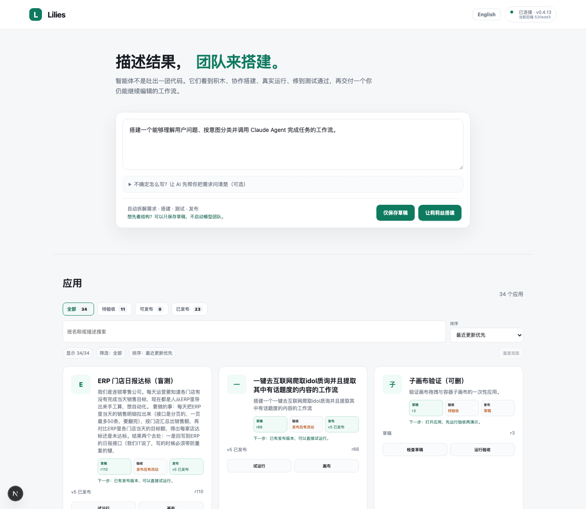
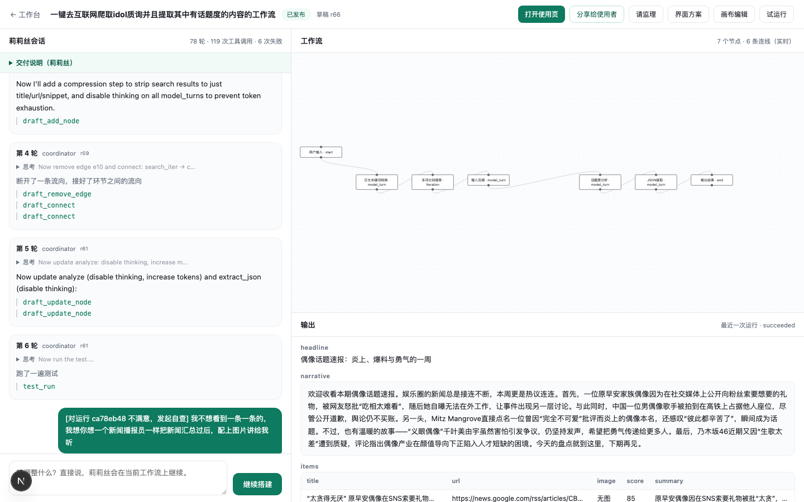
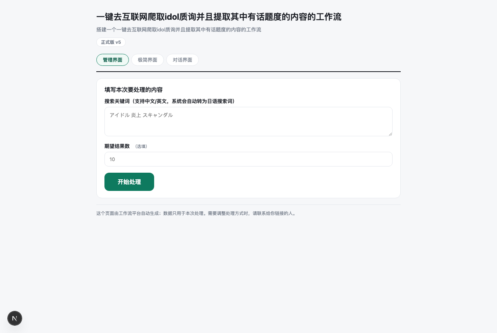
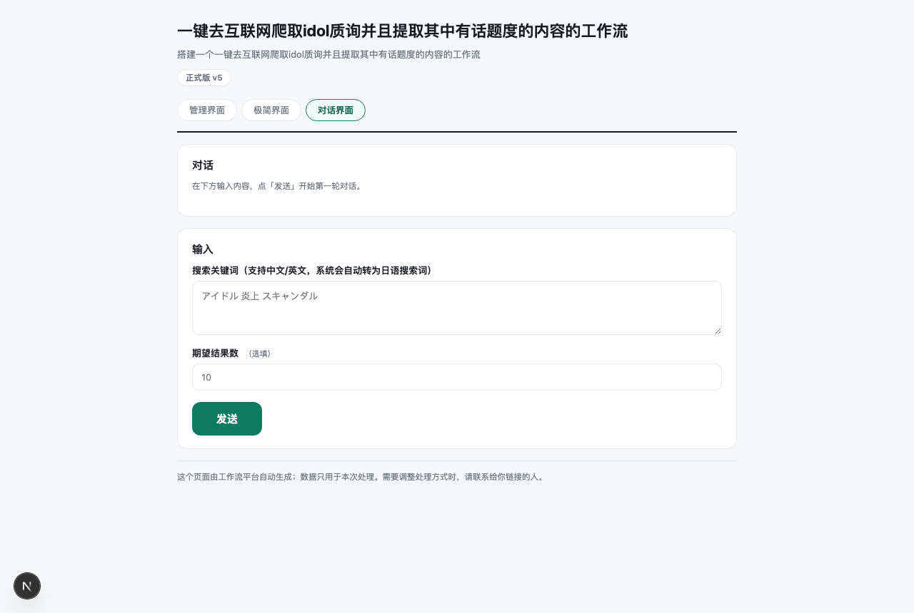
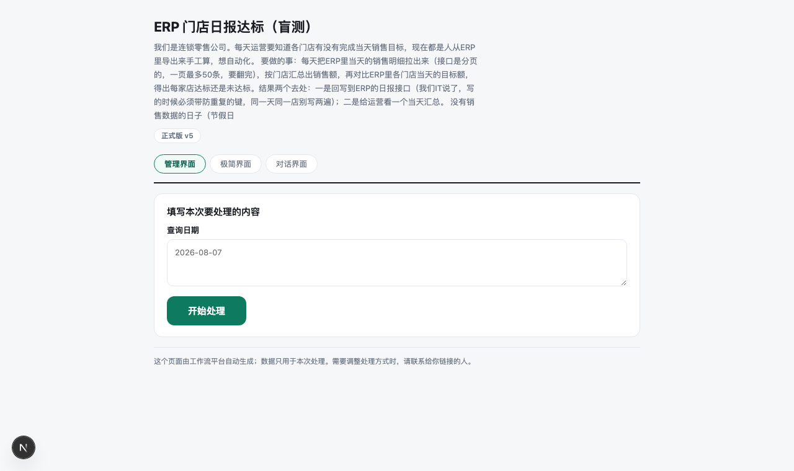
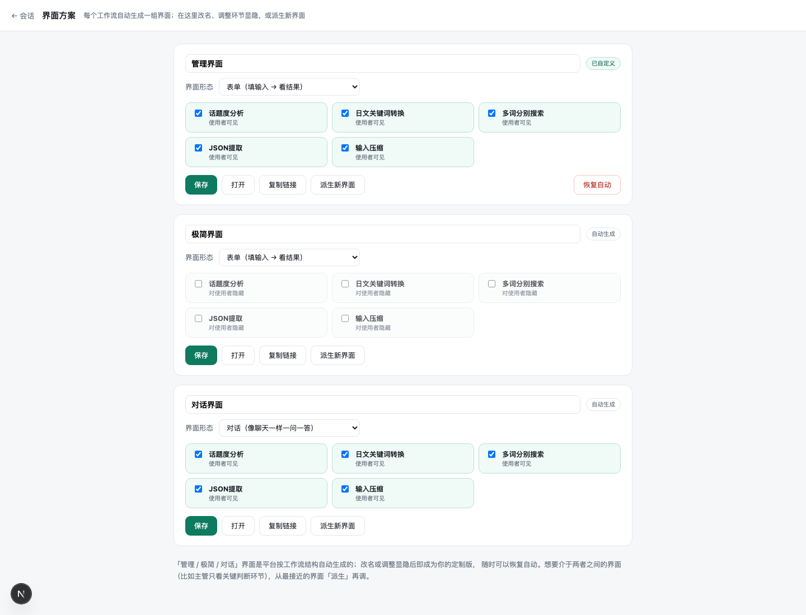
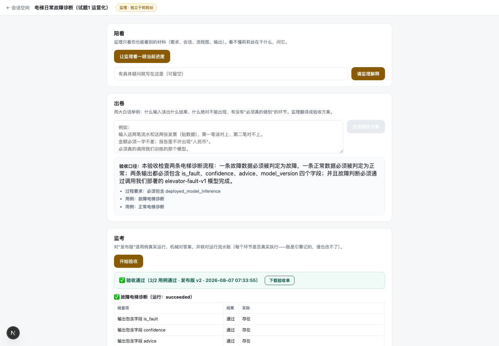
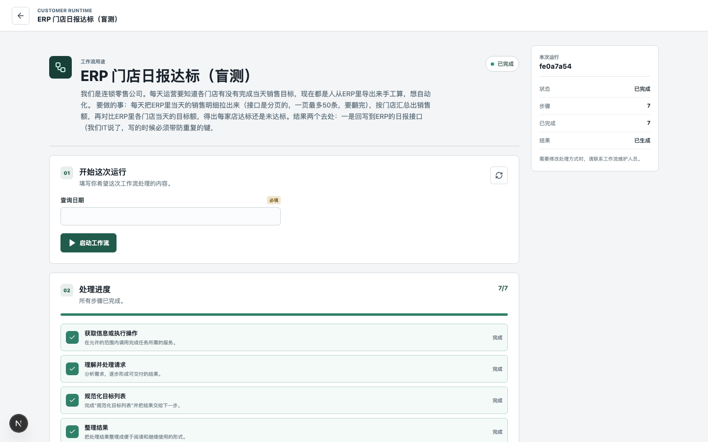

# Lilies 新特性使用报告（lean-core 重构后）

> 本报告所有截图均取自**真实运行中的平台**（2026-08-08 实拍），不是设计稿。
> 页面里的应用（idol 话题监测、ERP 门店日报、电梯故障诊断）都是走完真实构建与验收的项目。

---

## 1. 首页：一句话开工，一眼看清家底

打开平台，描述你要的结果，点「让莉莉丝搭建」即可开工——不需要理解任何技术概念。下方应用列表是你的全部资产：

- 右上角**运行态徽章**：绿色"已连接"说明平台健康（版本与全部关键路由实时自检）；
- 每张卡片显示三格状态：**草稿版本 / 验收 / 发布**——通过独立验收的应用显示绿色"已通过（N/N 用例）"，发布后又改过的显示"发布后有改动"（人话，不再是"证据已过期"）；
- 卡片主体点开直达**会话页**；快捷按钮到试运行与画布。

## 2. 会话页：应用的默认落地页，人话版的搭建过程

点进任何应用，先看到的是会话——不再是"一坨看不懂的东西"：

- **大事件系统徽章**：发布、等你回复、取消、故障，都以居中徽章插在对话流里（绿色"工作流已发布为正式版 v5，现在可以试运行了"）——不用猜发布没有；
- **中文动作行**：莉莉丝没说话的纯工具轮，自动翻译成"添加了「话题度分析」环节""跑了一遍测试"；
- **思考预览**：折叠行自带前 48 字预览，想深究再展开；
- **随时插话**：她搭建中你随时留言，下一轮开工前她会读到；
- 顶栏一排动作：**打开使用页**（一键看成品软件）、分享给使用者、请监理、界面方案、画布编辑、试运行。

右侧是实时生长的工作流图与最近一次运行的输出。

## 3. 使用页：一条链接就是一个软件（WaaS）

把「分享给使用者」的链接发给任何人（一条链接+一个访问码），对方打开就是一个能用的软件——每个工作流**自动生成一组界面**，标题下方一行标签随点随切：

| 标签 | 自动出现条件 | 形态 |
|---|---|---|
| 管理界面 | 永远有 | 表单 + 业务环节"过程"可展开审查 |
| 极简界面 | 有中间环节 | 全部过程隐藏，只看输入和结论 |
| 对话界面 | 含模型/问答环节 | 聊天式一问一答（有历史字段的工作流自动带上最近几轮记忆） |

**管理界面**（表单形态，标签栏可见）：

**对话界面**（同一个工作流，切一个标签）：

业务感更强的例子——ERP 门店日报达标（分页拉明细、比对目标、幂等回写 ERP，就是盲测通过的那条工作流）：

表格类输入支持 **Excel 上传 / 从 Excel 复制粘贴 / 网页内表格编辑**，普通用户永远不需要写 JSON。头部的"✓ 已通过独立验收"徽章让使用者知道这个软件是验收过的。

## 4. 界面方案：给不同的人不同的界面

「界面方案」页把自动生成的三件套摆成卡片，直接编辑：

- **改名 / 调整环节显隐 → 保存即定制**（卡片从"自动生成"变"已自定义"，随时一键恢复自动）；
- 想要中间态（比如主管只看关键判断环节），从最接近的界面**「派生新界面」**再调——标识自动生成，永远不用碰英文；
- 每张卡片可**打开 / 复制链接**；隐藏在服务端执行，被隐藏环节的输出不会离开后端；
- 莉莉丝交付时也会自己标注界面（`define_view` 已进她的交付纪律）。

## 5. 监理：独立于莉莉丝的第二双眼睛

每个应用的「请监理」页提供三件事（监理只看你也能看到的材料，说人话）：

- **陪看**：看不懂莉莉丝在干什么，让监理看一眼进度、替你解释；
- **出卷**：用大白话举例（"输入这两笔流水，第一笔该对上、第二笔对不上"），监理翻译成验收方案——截图里可见它把电梯项目翻译成了含"必须真调用 elevator-fault-v1 模型"的过程要求；
- **监考**：对发布版逐用例真实运行、机械对答案、核对执行流水账（每个环节是否真实执行——账是引擎记的，谁也改不了）。通过后出**验收单**可下载，首页卡片同步变绿。

## 6. 试运行与运行级返修

业主侧的试运行页逐步展示执行进度与结果。运行结束后平台自动体检：如果结果可疑（比如上游是空的、终端输出却填得满满当当），页面出现横幅和**「不满意？让莉莉丝自己查」**按钮——点一下，平台把这次运行的完整流水账（含输入参数身份）作为证据发给莉莉丝，她自查、修复、重新发布，全程不需要你写一个字的技术描述。

## 7. 幕后新能力速览（使用者无感，但决定了上面一切的成色）

- **公式引擎**：数值计算走确定性表达式（`$formula` / `$sum` 按条件聚合），LLM 不再碰算术——报表数字可复算；
- **平台自训模型**：表格类预测（如电梯故障判定 0.883 准确率）在平台内训练、评估、审批部署，工作流直接调用，监理审计"真调了模型"；
- **密钥库**：客户系统凭证存平台密钥库，工作流里只写引用——凭证永不出现在流程定义、转录或日志里；
- **诚实失败纪律**：空数据、截断、聚合形状不对等九类"静默垃圾"现在都会大声报中文错误并指路，而不是产出好看的假结果；
- **成本闸门**：构建历史滚动瘦身 + 前缀缓存纪律，单次构建成本降至此前的约 15%。

---

*报告与截图生成于 refactor/lean-core 分支（`47c301f` 之后），配套阶段总结见 [lean-core-stage-report.md](lean-core-stage-report.md)。*
